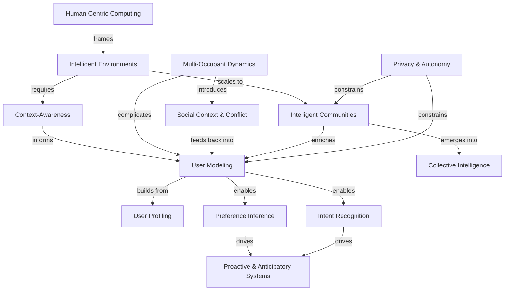

# Conceptual Map — PhD Dissertation

This graph reflects the core scientific concepts of the dissertation and how they relate to each other. It serves as the conceptual foundation from which research questions and objectives are derived.

## Concept Descriptions

| Concept | Role in dissertation |
|---|---|
| **Human-Centric Computing** | Overarching paradigm — the system serves the human, not the other way around |
| **Intelligent Environments** | The domain and deployment context (smart buildings) |
| **Context-Awareness** | Enables the environment to interpret situation, space, time, and activity |
| **User Modeling** | Dynamic, continuous process of building and updating a representation of the user |
| **User Profiling** | The structured representation of a user — feeds into and is refined by modeling |
| **Preference Inference** | Deriving what a user wants from known profile and context |
| **Intent Recognition** | Inferring latent needs from behavior and context — what the user has not yet expressed |
| **Proactive & Anticipatory Systems** | The target capability — acting on user needs before they are explicitly stated |
| **Multi-Occupant Dynamics** | The complexity introduced when multiple users share a space with potentially conflicting needs |
| **Social Context & Conflict** | Emergent from multi-occupancy — negotiation, priority, shared preferences |
| **Intelligent Communities** | Scale beyond a single building — buildings as agents in a community |
| **Collective Intelligence** | Emergent property of the community — shared knowledge that no single agent holds |
| **Privacy & Autonomy** | Hard constraint on both individual modeling and community sharing |

## Notes

- Temporal dynamics, trust, and explainability were considered and deliberately excluded as top-level concepts. They are treated as properties and challenges of the above concepts, addressed in the methodology and evaluation phases.
- The graph is ordered by abstraction: from paradigm (top) to emergent properties (bottom).
