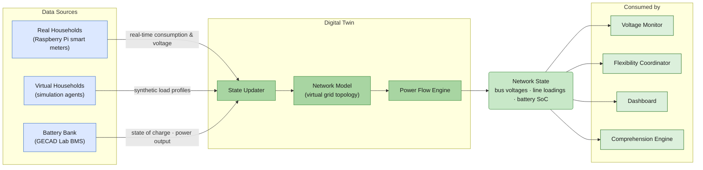
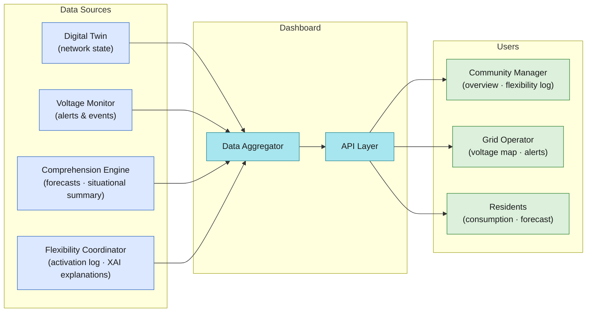
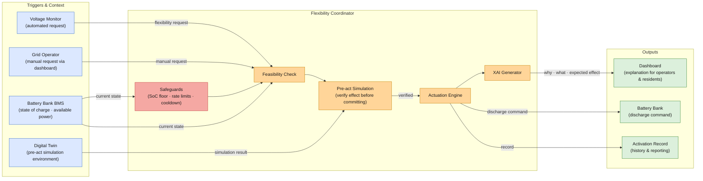
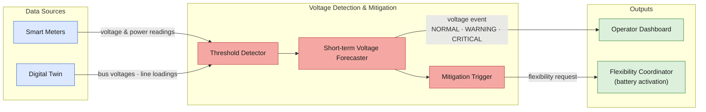

## 9. Integrated Status, Decision Support, and Control for Energy Communities and Distribution Networks [CEL, Digitalmente, Enerim, ISEP]

| **ID** | **Enabler Name**                                                                                | **Related Tasks** | **Addressed Requirements**                                       | **Related Use Case** |
| ------ | ----------------------------------------------------------------------------------------------- | ----------------- | ---------------------------------------------------------------- | -------------------- |
| EN_24  | Energy Community Operational Management and Governance Interface                                | T4.1, T4.3        | REQ_UC4.7, REQ_UC4.13, REQ_UC4.14                                | UC4                  |
| EN_25  | Human-in-the-Loop Community Action Validation Interface                                         | T4.3              | REQ_UC4.7                                                        | UC4                  |
| EN_26  | Regulatory, Environmental and Community Performance Reporting                                   | T4.2, T4.3        | REQ_UC4.11  REQ_UC4.15  REQ_UC4.17  REQ_UC4.18 | UC4                  |
| EN_27  | Energy Community Digital Twin Backbone                                                          | T4.1, T4.2        | REQ_UC4.1, REQ_UC4.2, REQ_UC4.10                                 | UC4                  |
| EN_28  | Energy Community Data Aggregation and Visualization Services                                    | T4.1, T4.2        | REQ_UC4.13, REQ_UC4.14                                           | UC4                  |
| EN_29  | Trust-Aware Digital Twin State Confidence Engine                                                | T4.1, T4.2, T4.3  | REQ_UC4.1  REQ_UC4.2   REQ_UC4.3  REQ_UC4.11   | UC4                  |
| EN_30  | Energy data sharing: Development for continuous delivery of meter data                          | T4.4              | REQ_UC4.7                                                        | UC4                  |
| EN_31  | Energy data sharing: REST APIs                                                                  | T4.4              | REQ_UC4.7                                                        | UC4                  |
| EN_32  | Flexibility services: Load control capabilities                                                 | T4.4              | REQ_UC4.7                                                        | UC4                  |
| EN_33  | Digital twin for electricity distribution network with distributed generation and flexible load | T4.1              | REQ_UC4.1, REQ_UC4.2                                             | UC4                  |
| EN_34  | Dashboard for energy community management                                                       | T4.1              | REQ_UC4.7, REQ_UC4.13, REQ_UC4.14                                | UC4                  |
| EN_35  | Activation of flexible resources, like storage and electric vehicles                            | T4.3              | REQ_UC4.10                                                       | UC4                  |
| EN_36  | Autonomous detection and mitigation of voltage issues                                           | T4.4              |                                                                  | UC4                  |
### 9.10	Digital twin for electricity distribution network with distributed generation and flexible load (EN_33) [ISEP]

The Digital Twin for Electricity Distribution Network (EN_33) is implementation of the network-level digital twin that models the UC4 distribution grid with heterogeneous generation assets, flexible loads, and battery storage. While EN_27 provides the community-level IoT integration backbone, EN_33 focuses on the power systems modelling layer: maintaining a topologically accurate, electrically valid model of the distribution network that can be used to compute bus voltages, line loadings, and power flow patterns across all scenarios, including normal operation, voltage exceedance events, and active flexibility interventions.

EN_33 addresses missing data replacement through model-based estimation (REQ_UC4.1) and data availability (REQ_UC4.2). The digital twin provides a continuous, gap-free representation of the network state even when direct measurements are unavailable. It is the computational engine that makes the voltage monitor (EN_36) and flexibility coordinator (EN_35) reliable.

The enabler architecture follows the concept diagram:

The state updater receives validated energy readings from households and the battery management system (BMS). Normalizes and merges these into a unified state vector for the network model.
The network model is based of pandapower representation of the distribution network, parameterised with actual line impedances, transformer ratings, bus topology, and installed generation and storage capacities. The network model is initialised from grid operator records and updated dynamically as new meters are enrolled or network reconfigurations occur.
The Power Flow Engine calculates at every state update cycle, computing bus voltages and line loadings from the injected power values. The engine flags violations: voltages outside ±5% of nominal (NORMAL → WARNING → CRITICAL) and lines loaded above rated capacity.
The Twin State Publisher serialises the full computed network state, such as bus voltages, line loadings, battery SoC, total generation, total consumption, and publishes it to the `twin-state` mqtt topic.

Data originates on real-time consumption and voltage readings from Raspberry Pi metering nodes; synthetic load profiles from the simulation agent; and BMS state (SoC, power output). It publishes network state to `twin-state`, from which Voltage Monitor (EN_36), Flexibility Coordinator (EN_35), Dashboard (EN_34), and the Comprehension Engine all read. Historical state snapshots are stored in a database and are accessible to EN_26 for performance reporting (REQ_UC4.11).

The State Updater and Power Flow Engine are implemented in Python using the pandapower library for network simulation. The network model is stored as a pandapower network object, serialised to JSON for persistence. The simulation agent runs synthetic load profiles from CSV files, replayed via MQTT to ensure a realistic mix of real and virtual household data during testing and demonstration phases. The Digital Twin service is deployed as a Kubernetes Deployment with horizontal scaling disabled (stateful, single-instance with shared memory).

EN_33 provides the electrical ground truth for UC4's operational decisions. By maintaining a continuously valid power flow model of the distribution network, it enables the Voltage Monitor to detect impending issues before they manifest as real faults, and the Flexibility Coordinator to simulate the effect of proposed actions before committing them. This *pre-act simulation* capability is central to UC4's strategy for reducing voltage issue events and cutting resolution.

---

### 9.11	Dashboard for energy community management (EN_34) [ISEP]

The Dashboard for Energy Community Management (EN_34) is the operational visualization layer for UC4, providing community managers, grid operators, and residents with a real-time, role-differentiated view of the energy community's status. It integrates data from all active operational layers, the Digital Twin (EN_33), Voltage Monitor (EN_36), Comprehension Engine, and Flexibility Coordinator (EN_35), into a unified, human-readable interface designed to support situational awareness and decision-making across all operational scenarios.

EN_34 directly addresses energy community management UI (REQ_UC4.7), energy community overview with consumption and production per member (REQ_UC4.13), and energy community import/export grid interaction visualisation (REQ_UC4.14).

The EN_34 architecture follows the concept diagram:

The Data Aggregator subscribes to the `twin-state`, `voltage-events`, `comprehension-outputs`, and `flexibility-requests` Kafka topics, maintaining aggregated in-memory views of per-member consumption and production, community net energy balance, active voltage alerts, current and historical flexibility activations, and consumption forecasts from the Comprehension Engine.
The API Layer exposes the aggregated data via a FastAPI REST backend with versioned endpoints, supporting both polling for page loads and WebSocket push for real-time alert updates and live KPI refresh at 1-minute intervals (REQ_UC4.11).
The Community Manager View shows the full community energy balance (import, export, generation, storage SoC), active flexibility events, member-level consumption overview, and voltage alert status, and enables the community manager to trigger the HITL validation workflow (EN_25) for pending flexibility actions.
The Grid Operator View presents the network voltage map with bus voltage levels and line loading percentages, active and predicted voltage events from EN_36, and a log of flexibility activations with their grid impact.
The Resident View shows individual household consumption and production, the household's contribution to flexibility events, and personalised consumption forecasts, designed to foster engagement and transparency without exposing other members' data (REQ_UC4.17).

EN_34 consumes state from the `twin-state`, `voltage-events`, `comprehension-outputs`, and `flexibility-requests` MQTT topics, as well as historical data from the database for trend charts. It reads XAI explanations from the XAI Generator (EN_35) for display alongside flexibility activation records. All data is served through the API Gateway with RBAC enforcement. The dashboard reads historical consumption data from the database for the 7-day and 30-day trend charts visible in the community manager and resident views.

The frontend is implemented in Vue.js with reactive components updated via WebSocket. It will use other publicly available libraries for given components, such as charts or maps. The backend API is developed in Python and deployed as a container. The dashboard is responsive and accessible via standard web browsers, requiring no additional client software.

EN_34 closes the information loop between machine-generated situational awareness and human decision-making. By presenting the Digital Twin's network state, the Comprehension Engine's forecasts, and the Flexibility Coordinator's recommended actions in a coherent, role-appropriate interface, it enables community managers and grid operators to act decisively and confidently. It is the primary tool through which UC4's human stakeholders engage with the system on a daily basis, and its design directly supports the KPI targets for reducing the average time required to resolve voltage and line capacity issues.

---

### 9.12	Activation of flexible resources, like storage and electric vehicles (EN_35) [ISEP]

The Activation of Flexible Resources enabler (EN_35) is the action layer of UC4's operational architecture. It is responsible for translating flexibility needs — identified by the Voltage Monitor (EN_36) or requested by the DSO — into validated, safe, and explainable actuation commands dispatched to the GECAD Lab battery bank. EN_35 implements a structured decision workflow that combines automated flexibility assessment, pre-act simulation, human-in-the-loop validation (EN_25), and XAI-generated explanations, ensuring that every actuation is traceable, safe, and auditable.

EN_35 directly addresses IoT data retrieval and actuation of IoT devices, specifically the battery bank (REQ_UC4.10), and DSO emergency flexibility signal for real-time direct load control (REQ_UC4.12). It is the operational realisation of all three UC4 flexibility scenarios: battery discharge for voltage support, load reduction for line capacity management, and energy self-sufficiency during high price periods.

The EN_35 architecture follows the concept diagram:

The Safeguards module checks battery operational constraints before any action is evaluated: minimum state of charge (SoC floor, default 20%), maximum discharge rate, cooldown period since last activation, and availability status reported by the BMS. Requests that violate any constraint are immediately rejected with an explanatory response.
The Feasibility Check evaluates whether the requested flexibility magnitude is achievable given the current BMS state and the contracted flexibility parameters for the affected community members.
The Pre-act Simulation submits the proposed action to the Digital Twin (EN_33) as a hypothetical scenario: the Digital Twin runs a power flow calculation with the battery discharge applied and returns the projected network state. If the simulation confirms that the action resolves the triggering issue without creating new constraint violations, the action proceeds to validation.
The Actuation Engine dispatches the validated discharge command to the BMS via a direct control interface, monitors the BMS response (command acknowledged, power output ramping, SoC trajectory), and publishes the battery state update back to the Digital Twin's State Updater.
The XAI Generator produces a structured natural language explanation of the actuation decision — why the action was triggered, what the pre-act simulation predicted, what constraints were evaluated, and what the expected grid impact is — and forwards this explanation to the Dashboard (EN_34) and the HITL validation panel (EN_25).
The Activation Record persists the full event — trigger, decision rationale, simulation result, operator approval, BMS command, and post-activation metered outcome — to PostgreSQL for audit, reporting (EN_26), and model improvement.

EN_35 receives flexibility requests from the `flexibility-requests` Kafka topic (published by EN_36) and from the DSO via the Dashboard (EN_34). It reads BMS state from the direct BMS interface and network state from the `twin-state` topic for pre-act simulation input. It publishes approved discharge commands to the BMS, battery state updates to the Digital Twin, XAI explanations to the API Gateway, and activation records to PostgreSQL. Activation outcomes are published to the `flexibility-requests` topic as status updates, consumed by EN_26 for KPI computation.

The Safeguards, Feasibility Check, and Pre-act Simulation components are implemented in Python as a stateful microservice. The Actuation Engine communicates with the BMS via a proprietary control interface exposed over a local network connection (direct control, not mediated by Kafka). The XAI Generator uses a template-based explanation framework combined with SHAP-based feature importance attribution for the flexibility estimation model outputs. The entire service is deployed on Kubernetes with access restricted to authorised platform services via network policy. Activation records are signed with a service identity key to support non-repudiation (REQ_UC4.15).

EN_35 is where UC4's intelligence becomes physical action. By implementing a rigorous pre-actuation validation pipeline — including safety checks, simulation-based verification, human approval, and XAI-generated rationale — it ensures that the system's decisions are both effective and trustworthy. The combination of battery storage activation and, through EN_32, load control at member premises gives UC4 a comprehensive flexibility portfolio capable of addressing all three operational scenarios. EN_35 is the primary driver of the KPI targets for voltage issue frequency and resolution time.

---

### 9.13	Autonomous detection and mitigation of voltage issues (EN_36) [ISEP]

**Purpose and Role**

The Autonomous Detection and Mitigation of Voltage Issues enabler (EN_36) provides UC4 with the real-time monitoring and automated alerting capability needed to detect abnormal voltage conditions in the distribution network and trigger appropriate mitigation responses without requiring constant manual attention from the community manager or grid operator. It implements the perception-to-action arc for UC4's primary operational scenario (Scenario 1: Voltage Management) and contributes to Scenario 2 (Line Capacity Management) by monitoring both voltage levels and line loading.

EN_36 is the automated sentinel of UC4's network health. When it detects a voltage exceedance or forecasts an imminent one, it autonomously generates a flexibility request for EN_35 and alerts the Dashboard (EN_34), enabling either automated or human-in-the-loop resolution (EN_25) within the 10-minute resolution time target set in UC4's KPIs.

**Architecture and Components**

The EN_36 architecture follows the concept diagram:

The Threshold Detector subscribes to the `raw-readings` and `twin-state` Kafka topics and at each update cycle evaluates all bus voltage levels and line loadings against configurable thresholds: voltages outside ±5% of nominal are flagged as WARNING, voltages outside ±10% as CRITICAL, and line loadings above 90% of rated capacity are flagged. Threshold crossings are timestamped and classified by severity.
The Short-term Voltage Forecaster is triggered when a WARNING or CRITICAL condition is detected, or when trend analysis suggests an imminent exceedance. It applies a Temporal Fusion Transformer model trained on historical voltage and load profiles to project the voltage trajectory over the next 15–30 minutes, enabling proactive intervention before CRITICAL violations materialise.
The Mitigation Trigger generates a structured flexibility request based on the current event classification and the forecast trajectory, specifying the affected network bus, the required magnitude of load reduction or generation increase, and the urgency level, and publishes it to the `flexibility-requests` Kafka topic for EN_35 to act upon.
The Event Publisher publishes classified voltage events — with their severity level, affected bus, forecast trajectory, and mitigation request status — to the `voltage-events` Kafka topic, from which the Dashboard (EN_34) and the API Gateway consume for display and notification.

**Data Flows and Interfaces**

EN_36 consumes voltage and power readings from the `raw-readings` topic (direct sensor data, 1-minute granularity — REQ_UC4.11) and bus voltages and line loadings from the `twin-state` topic (Digital Twin computed values). It publishes classified voltage events to `voltage-events` and flexibility requests to `flexibility-requests`. The flexibility request is consumed by EN_35 (battery activation) and EN_32 (load control via EnerimCIS). Event history is persisted to the database for KPI tracking (voltage issue count, duration) by EN_26. Active alerts are surfaced in real time through the Dashboard (EN_34).

**Technologies and Implementation**

The Threshold Detector is implemented as a stateless Kafka Streams processor, enabling low-latency event detection. The Short-term Voltage Forecaster uses a PyTorch-based Temporal Fusion Transformer model, retrained periodically on accumulated grid history. The model is stored in the Model Registry and loaded at service startup. Inference is run at each Threshold Detector trigger, with a target latency under 500ms to maintain real-time responsiveness. The Mitigation Trigger applies a decision tree with configurable urgency thresholds, separating automated (CRITICAL) from human-validated (WARNING) response paths. The entire service is deployed as a Kubernetes Deployment with a dedicated resource quota to guarantee response time under load.

**Contribution to SA4CPS Goals**

EN_36 is the operational intelligence enabler that transforms UC4 from a reactive monitoring system into a proactive grid management platform. By continuously assessing network health and autonomously generating mitigation signals before voltage issues reach critical severity, it enables UC4 to demonstrate tangible operational value: reducing voltage issue events from 20 to 2 and cutting average resolution time from 30 minutes to 10 minutes. Together with EN_35 (actuation) and EN_25 (human validation), EN_36 completes UC4's perception-comprehension-action loop for autonomous and assisted distribution grid management.
