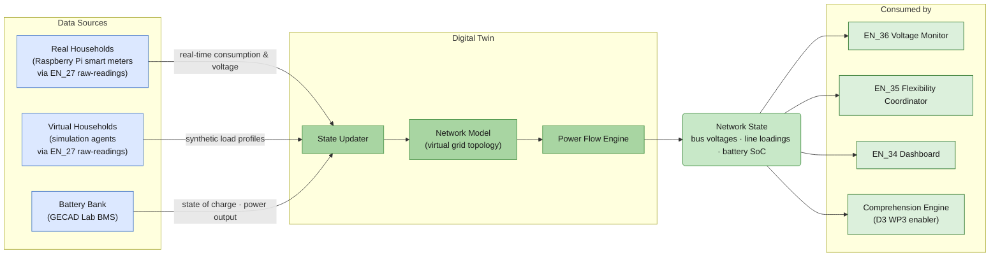
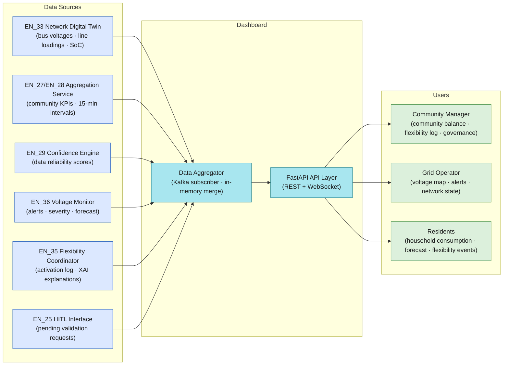
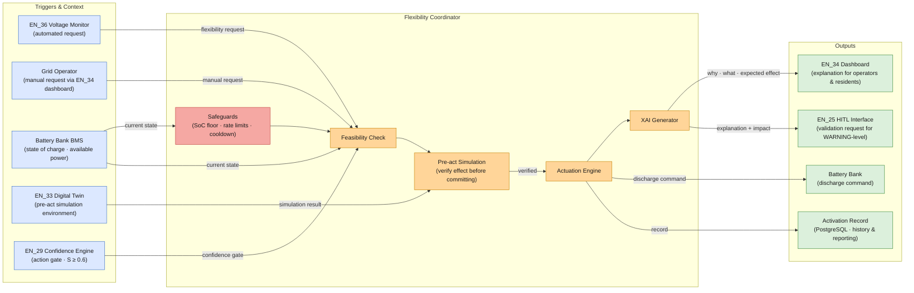
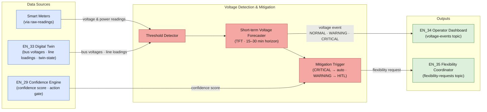

## 9. Integrated Status, Decision Support, and Control for Energy Communities and Distribution Networks [CEL, Digitalmente, Enerim, ISEP]

| **ID** | **Enabler Name**                                                                                | **Related Tasks** | **Addressed Requirements**                                       | **Related Use Case** |
| ------ | ----------------------------------------------------------------------------------------------- | ----------------- | ---------------------------------------------------------------- | -------------------- |
| EN_24  | Energy Community Operational Management and Governance Interface                                | T4.1, T4.3        | REQ_UC4.7, REQ_UC4.13, REQ_UC4.14                                | UC4                  |
| EN_25  | Human-in-the-Loop Community Action Validation Interface                                         | T4.3              | REQ_UC4.7                                                        | UC4                  |
| EN_26  | Regulatory, Environmental and Community Performance Reporting                                   | T4.2, T4.3        | REQ_UC4.11, REQ_UC4.15, REQ_UC4.17, REQ_UC4.18                  | UC4                  |
| EN_27  | Energy Community Digital Twin Backbone                                                          | T4.1, T4.2        | REQ_UC4.1, REQ_UC4.2, REQ_UC4.10                                 | UC4                  |
| EN_28  | Energy Community Data Aggregation and Visualization Services                                    | T4.1, T4.2        | REQ_UC4.13, REQ_UC4.14                                           | UC4                  |
| EN_29  | Trust-Aware Digital Twin State Confidence Engine                                                | T4.1, T4.2, T4.3  | REQ_UC4.1, REQ_UC4.2, REQ_UC4.3, REQ_UC4.11                     | UC4                  |
| EN_30  | Energy data sharing: Development for continuous delivery of meter data                          | T4.4              | REQ_UC4.7                                                        | UC4                  |
| EN_31  | Energy data sharing: REST APIs                                                                  | T4.4              | REQ_UC4.7                                                        | UC4                  |
| EN_32  | Flexibility services: Load control capabilities                                                 | T4.4              | REQ_UC4.7                                                        | UC4                  |
| EN_33  | Digital twin for electricity distribution network with distributed generation and flexible load | T4.1              | REQ_UC4.1, REQ_UC4.2                                             | UC4                  |
| EN_34  | Dashboard for energy community management                                                       | T4.1              | REQ_UC4.7, REQ_UC4.13, REQ_UC4.14                                | UC4                  |
| EN_35  | Activation of flexible resources, like storage and electric vehicles                            | T4.3              | REQ_UC4.10                                                       | UC4                  |
| EN_36  | Autonomous detection and mitigation of voltage issues                                           | T4.4              |                                                                  | UC4                  |

The UC4 enabler set forms a layered operational architecture for energy communities and distribution networks. D4.2 established the specification baseline for all thirteen enablers, defining their functional scope, responsibilities, and cross-enabler dependencies. D4.3 progresses to the design level: it details the internal structure, interfaces, technology choices, and integration contracts that realise those specifications. The architecture is structured around three tiers — a data and state layer (EN_27, EN_29, EN_33), a reasoning and action layer (EN_25, EN_28, EN_35, EN_36), and a presentation and reporting layer (EN_24, EN_26, EN_34) — connected by a shared Kafka message bus and a PostgreSQL/InfluxDB storage backend, all deployed on the GECAD Kubernetes platform.

---
### 9.10	Digital twin for electricity distribution network with distributed generation and flexible load (EN_33) [ISEP]

The Digital Twin for Electricity Distribution Network (EN_33) is the network-level power systems model for UC4. While EN_27 provides the community-level IoT integration backbone — aggregating prosumer consumption and generation data — EN_33 operates on those values as electrical injections and computes the resulting physical network state: bus voltages, line loadings, and power flow patterns across the distribution grid topology. The two twins are complementary: EN_27 is the community data authority; EN_33 is the electrical model authority.

EN_33 addresses missing data replacement through model-based estimation (REQ_UC4.1) and data availability (REQ_UC4.2). The digital twin provides a continuous, gap-free representation of the network state even when direct measurements are unavailable — it inherits EN_27's state estimation flags and uses baseline load profiles to synthesise plausible injection values for any prosumer whose reading is marked `estimated`. It is the computational engine that makes the voltage monitor (EN_36) and flexibility coordinator (EN_35) reliable.

The enabler architecture follows the concept diagram:

The State Updater receives validated energy readings from EN_27's `raw-readings` Kafka topic (both real and virtual households) and direct BMS telemetry. It normalises and merges these into a unified injection vector for the network model, propagating EN_27's `estimated` flags into a per-bus data quality label consumed by EN_29's confidence engine.

The Network Model is a pandapower representation of the UC4 distribution network, parameterised with actual line impedances, transformer ratings, bus topology, and installed generation and storage capacities. The model is initialised from grid operator records and updated dynamically as new meters are enrolled or network reconfigurations occur. The topology is stored as a pandapower network object, serialised to JSON for persistence in the Model Registry.

The Power Flow Engine executes a Newton-Raphson AC power flow at every state update cycle (default: 1 minute). It computes bus voltages and line loadings from the injected power values and flags violations: voltages outside ±5% of nominal (NORMAL → WARNING → CRITICAL) and lines loaded above 90% of rated capacity. The Twin State Publisher serialises the full computed network state — bus voltages, line loadings, battery SoC, total generation, total consumption — and publishes it to the `twin-state` Kafka topic.

EN_33 receives injection data from the `raw-readings` topic (published by EN_27), BMS state directly from the GECAD Lab BMS interface, and battery state feedback from EN_35 following flexibility activations. It publishes network state to `twin-state`, from which EN_36 (Voltage Monitor), EN_35 (Flexibility Coordinator), EN_34 (Dashboard), and the D3 Comprehension Engine all read. Historical state snapshots are stored in InfluxDB and are accessible to EN_26 for performance reporting (REQ_UC4.11).

The State Updater and Power Flow Engine are implemented in Python using the pandapower library. The network model is stored as a pandapower network object, serialised to JSON for persistence. The simulation agent replays synthetic load profiles from CSV files via MQTT to ensure a realistic mix of real and virtual household data during testing and demonstration. The Digital Twin service is deployed as a Kubernetes Deployment with horizontal scaling disabled (stateful, single-instance with shared memory) and a dedicated PersistentVolumeClaim for the network model JSON.

EN_33 provides the electrical ground truth for UC4's operational decisions. By maintaining a continuously valid power flow model of the distribution network, it enables EN_36 to detect impending voltage issues before they manifest as real faults, and EN_35 to simulate the effect of proposed actions before committing them. This *pre-act simulation* capability — EN_35 submitting a hypothetical discharge command to EN_33 and receiving a projected network state in return — is central to UC4's strategy for reducing voltage issue events and cutting resolution time.

---

### 9.11	Dashboard for energy community management (EN_34) [ISEP]

The Dashboard for Energy Community Management (EN_34) is the operational visualisation layer for UC4, providing community managers, grid operators, and residents with a real-time, role-differentiated view of the energy community's status. EN_34 sits at the intersection of multiple upstream enablers: it consumes the electrical ground truth from EN_33, the community IoT state from EN_27 via EN_28, the confidence metadata from EN_29, voltage alerts from EN_36, and flexibility activation records with XAI explanations from EN_35. It is the ISEP-implemented front-end that renders these streams as a coherent human interface, complementing EN_24 (CEL's governance dashboard) with an operationally oriented real-time view.

EN_34 directly addresses energy community management UI (REQ_UC4.7), energy community overview with consumption and production per member (REQ_UC4.13), and energy community import/export grid interaction visualisation (REQ_UC4.14).

The EN_34 architecture follows the concept diagram:

The Data Aggregator subscribes to the `twin-state`, `raw-readings`, `voltage-events`, `comprehension-outputs`, and `flexibility-requests` Kafka topics, maintaining aggregated in-memory views of: per-member consumption and production, community net energy balance, active voltage alerts with severity and forecast trajectory, current and historical flexibility activations, and consumption forecasts from the Comprehension Engine. EN_29 confidence scores are merged into the in-memory view and exposed as reliability metadata alongside each KPI — panels sourced from low-confidence data render with a visual indicator warning the operator.

The API Layer exposes the aggregated data via a FastAPI REST backend with versioned endpoints, supporting both polling for page loads and WebSocket push for real-time alert updates and live KPI refresh at 1-minute intervals (REQ_UC4.11). The Community Manager View shows the full community energy balance (import, export, generation, storage SoC), active flexibility events with XAI explanations from EN_35, member-level consumption overview, and voltage alert status. It also surfaces EN_25 pending validation requests as an action queue, enabling the community manager to trigger the HITL workflow directly from the dashboard. The Grid Operator View presents the network voltage map with bus voltage levels and line loading percentages derived from EN_33's `twin-state`, active and predicted voltage events from EN_36, and a log of flexibility activations with their grid impact. The Resident View shows individual household consumption and production, the household's contribution to flexibility events, and personalised consumption forecasts — designed to foster engagement and transparency without exposing other members' data (REQ_UC4.17).

EN_34 also reads XAI explanations published by EN_35 for display alongside flexibility activation records in both the Community Manager and Grid Operator views, ensuring that every actuation decision is traceable and human-interpretable. Historical consumption data from InfluxDB supports 7-day and 30-day trend charts visible in the community manager and resident views. All data is served through the API Gateway with RBAC enforcement; resident views are strictly scoped to the authenticated household.

The frontend is implemented in Vue.js with reactive components updated via WebSocket, targeting sub-second refresh for alert events. The backend API is deployed as a containerised Python service on Kubernetes. The dashboard is responsive and accessible via standard web browsers, requiring no additional client software.

EN_34 closes the information loop between machine-generated situational awareness and human decision-making. By presenting EN_33's network state, the Comprehension Engine's forecasts, and EN_35's recommended actions in a coherent, role-appropriate interface, it enables community managers and grid operators to act decisively and confidently. It is the primary tool through which UC4's human stakeholders engage with the system on a daily basis, and its design directly supports the KPI targets for reducing the average time required to resolve voltage and line capacity issues.

---

### 9.12	Activation of flexible resources, like storage and electric vehicles (EN_35) [ISEP]

The Activation of Flexible Resources enabler (EN_35) is the action layer of UC4's operational architecture. It is responsible for translating flexibility needs — identified by EN_36 or requested by the DSO — into validated, safe, and explainable actuation commands dispatched to the GECAD Lab battery bank. EN_35 implements a structured decision workflow that combines automated flexibility assessment, pre-act simulation using EN_33, human-in-the-loop validation via EN_25, and XAI-generated explanations, ensuring that every actuation is traceable, safe, and auditable.

EN_35 directly addresses IoT data retrieval and actuation of IoT devices, specifically the battery bank (REQ_UC4.10), and DSO emergency flexibility signal for real-time direct load control (REQ_UC4.12). It is the operational realisation of all three UC4 flexibility scenarios: battery discharge for voltage support, load reduction for line capacity management, and energy self-sufficiency during high price periods.

The EN_35 architecture follows the concept diagram:

The Safeguards module checks battery operational constraints before any action is evaluated: minimum state of charge (SoC floor, default 20%), maximum discharge rate, cooldown period since last activation (default 15 minutes), and availability status reported by the BMS. Requests that violate any constraint are immediately rejected with an explanatory response published back to the `flexibility-requests` topic.

The Feasibility Check evaluates whether the requested flexibility magnitude is achievable given the current BMS state and the contracted flexibility parameters for the affected community members. It also invokes EN_29's confidence gate: if the current community confidence score S < 0.6, the action is escalated to EN_25 for mandatory human validation regardless of the triggering event's CRITICAL classification.

The Pre-act Simulation submits the proposed action to EN_33 as a hypothetical scenario: EN_33 runs a power flow calculation with the battery discharge applied and returns the projected network state. If the simulation confirms that the action resolves the triggering issue without creating new constraint violations (e.g., causing undervoltage on another bus), the action proceeds. CRITICAL-level automated actions proceed directly to the Actuation Engine; WARNING-level actions and all actions flagged by EN_29's confidence gate are routed to EN_25 for operator approval before execution.

The Actuation Engine dispatches the validated discharge command to the BMS via a direct control interface (non-Kafka, dedicated local network connection), monitors the BMS response (command acknowledged, power output ramping, SoC trajectory), and publishes the battery state update back to EN_33's State Updater to keep the network model current.

The XAI Generator produces a structured natural language explanation of the actuation decision — why the action was triggered, what the pre-act simulation predicted, what constraints were evaluated, and what the expected grid impact is — and forwards this explanation to EN_34 (Dashboard) and EN_25 (HITL validation panel) via the `flexibility-requests` Kafka topic as an `explanation` payload field.

The Activation Record persists the full event — trigger, decision rationale, EN_29 confidence score at time of decision, simulation result, operator approval (if EN_25 path was taken), BMS command, and post-activation metered outcome — to PostgreSQL for audit, EN_26 reporting, and model improvement.

The Safeguards, Feasibility Check, and Pre-act Simulation components are implemented in Python as a stateful microservice. The Actuation Engine communicates with the BMS via a proprietary control interface exposed over a local network connection. The XAI Generator uses a template-based explanation framework combined with SHAP-based feature importance attribution for the flexibility estimation model outputs. The entire service is deployed on Kubernetes with access restricted to authorised platform services via network policy. Activation records are signed with a service identity key to support non-repudiation (REQ_UC4.15).

EN_35 is where UC4's intelligence becomes physical action. By implementing a rigorous pre-actuation validation pipeline — including safety checks, EN_33 simulation-based verification, EN_25 human approval (where required), EN_29 confidence gating, and XAI-generated rationale — it ensures that the system's decisions are both effective and trustworthy. The combination of battery storage activation and, through EN_32, load control at member premises gives UC4 a comprehensive flexibility portfolio capable of addressing all three operational scenarios. EN_35 is the primary driver of the KPI targets for voltage issue frequency and resolution time.

---

### 9.13	Autonomous detection and mitigation of voltage issues (EN_36) [ISEP]

The Autonomous Detection and Mitigation of Voltage Issues enabler (EN_36) provides UC4 with the real-time monitoring and automated alerting capability needed to detect abnormal voltage conditions in the distribution network and trigger appropriate mitigation responses without requiring constant manual attention from the community manager or grid operator. It implements the perception-to-action arc for UC4's primary operational scenario (Scenario 1: Voltage Management) and contributes to Scenario 2 (Line Capacity Management) by monitoring both voltage levels and line loading.

EN_36 is the automated sentinel of UC4's network health. When it detects a voltage exceedance or forecasts an imminent one, it autonomously generates a flexibility request for EN_35 and alerts EN_34 (Dashboard), enabling either automated or human-in-the-loop resolution (EN_25) within the 10-minute resolution time target set in UC4's KPIs. EN_29's confidence scores are consumed as an input signal: when network-state confidence is low, EN_36 reduces the urgency classification of a detected event (e.g., CRITICAL → WARNING) to prevent automated actions based on unreliable measurements.

The EN_36 architecture follows the concept diagram:

The Threshold Detector subscribes to the `raw-readings` and `twin-state` Kafka topics and at each update cycle evaluates all bus voltage levels and line loadings against configurable thresholds: voltages outside ±5% of nominal are flagged as WARNING, voltages outside ±10% as CRITICAL, and line loadings above 90% of rated capacity are flagged. Threshold crossings are timestamped and classified by severity. When EN_29's confidence score S < 0.6, the Threshold Detector applies a one-level severity downgrade (CRITICAL → WARNING, WARNING → INFO) before forwarding to the Mitigation Trigger, ensuring that low-confidence network states do not drive automated physical actions.

The Short-term Voltage Forecaster is triggered when a WARNING or CRITICAL condition is detected, or when trend analysis suggests an imminent exceedance. It applies a Temporal Fusion Transformer (TFT) model trained on historical voltage and load profiles to project the voltage trajectory over the next 15–30 minutes, enabling proactive intervention before CRITICAL violations materialise. The model is stored in the Model Registry (shared with the D3 Comprehension Engine) and loaded at service startup. Inference runs at each Threshold Detector trigger with a target latency under 500ms.

The Mitigation Trigger generates a structured flexibility request based on the current event classification and the forecast trajectory, specifying the affected network bus, the required magnitude of load reduction or generation increase, and the urgency level. CRITICAL events (after confidence adjustment) generate automated requests consumed directly by EN_35; WARNING events generate requests that EN_35 will route to EN_25 for human validation. All events are published to the `voltage-events` Kafka topic for EN_34 and EN_26 consumption.

The Event Publisher publishes classified voltage events — with their severity level, affected bus, forecast trajectory, EN_29 confidence score, and mitigation request status — to the `voltage-events` Kafka topic, from which EN_34 (Dashboard) and the API Gateway consume for display and notification.

EN_36 consumes voltage and power readings from `raw-readings` (direct sensor data, 1-minute granularity — REQ_UC4.11) and bus voltages and line loadings from `twin-state` (EN_33 computed values). It publishes classified voltage events to `voltage-events` and flexibility requests to `flexibility-requests`. The flexibility request is consumed by EN_35 (battery activation) and EN_32 (load control via EnerimCIS). Event history is persisted to InfluxDB for KPI tracking (voltage issue count, duration) by EN_26. Active alerts are surfaced in real time through EN_34.

The Threshold Detector is implemented as a stateless Kafka Streams processor, enabling low-latency event detection. The Short-term Voltage Forecaster uses a PyTorch-based TFT model, retrained periodically on accumulated grid history. The Mitigation Trigger applies a decision tree with configurable urgency thresholds, separating automated (CRITICAL, high-confidence) from human-validated (WARNING or low-confidence) response paths. The entire service is deployed as a Kubernetes Deployment with a dedicated resource quota to guarantee response time under load.

EN_36 is the operational intelligence enabler that transforms UC4 from a reactive monitoring system into a proactive grid management platform. By continuously assessing network health — informed by EN_33's electrical model, EN_29's data quality assessment, and EN_35's action capability — and autonomously generating mitigation signals before voltage issues reach critical severity, it enables UC4 to demonstrate tangible operational value: reducing voltage issue events from 20 to 2 and cutting average resolution time from 30 minutes to 10 minutes. Together with EN_35 (actuation) and EN_25 (human validation), EN_36 completes UC4's perception-comprehension-action loop for autonomous and assisted distribution grid management.
