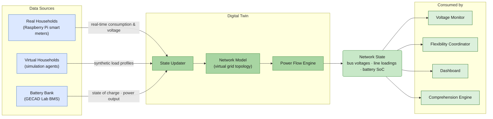

## 9. Integrated Status, Decision Support, and Control for Energy Communities and Distribution Networks [CEL, Digitalmente, Enerim, ISEP]

| **ID** | **Enabler Name**                                                                                | **Related Tasks** | **Addressed Requirements**                                       | **Related Use Case** |
| ------ | ----------------------------------------------------------------------------------------------- | ----------------- | ---------------------------------------------------------------- | -------------------- |
| EN_24  | Energy Community Operational Management and Governance Interface                                | T4.1, T4.3        | REQ_UC4.7, REQ_UC4.13, REQ_UC4.14                                | UC4                  |
| EN_25  | Human-in-the-Loop Community Action Validation Interface                                         | T4.3              | REQ_UC4.7                                                        | UC4                  |
| EN_26  | Regulatory, Environmental and Community Performance Reporting                                   | T4.2, T4.3        | REQ_UC4.11  REQ_UC4.15  REQ_UC4.17  REQ_UC4.18 | UC4                  |
| EN_27  | Energy Community Digital Twin Backbone                                                          | T4.1, T4.2        | REQ_UC4.1, REQ_UC4.2, REQ_UC4.10                                 | UC4                  |
| EN_28  | Energy Community Data Aggregation and Visualization Services                                    | T4.1, T4.2        | REQ_UC4.13, REQ_UC4.14                                           | UC4                  |
| EN_29  | Trust-Aware Digital Twin State Confidence Engine                                                | T4.1, T4.2, T4.3  | REQ_UC4.1  REQ_UC4.2   REQ_UC4.3  REQ_UC4.11   | UC4                  |
| EN_30  | Energy data sharing: Development for continuous delivery of meter data                          | T4.4              | REQ_UC4.7                                                        | UC4                  |
| EN_31  | Energy data sharing: REST APIs                                                                  | T4.4              | REQ_UC4.7                                                        | UC4                  |
| EN_32  | Flexibility services: Load control capabilities                                                 | T4.4              | REQ_UC4.7                                                        | UC4                  |
| EN_33  | Digital twin for electricity distribution network with distributed generation and flexible load | T4.1              | REQ_UC4.1, REQ_UC4.2                                             | UC4                  |
| EN_34  | Dashboard for energy community management                                                       | T4.1              | REQ_UC4.7, REQ_UC4.13, REQ_UC4.14                                | UC4                  |
| EN_35  | Activation of flexible resources, like storage and electric vehicles                            | T4.3              | REQ_UC4.10                                                       | UC4                  |
| EN_36  | Autonomous detection and mitigation of voltage issues                                           | T4.4              |                                                                  | UC4                  |
### 9.1	Energy Community Operational Management and Governance Interface (EN_24) [CEL]

**Purpose and Role**

The Energy Community Operational Management and Governance Interface (EN_24) provides community managers with a unified, web-based control panel through which the operational, contractual, and governance activities of UC4's energy community can be administered. Within the UC4 scenario, CEL acts as the energy community manager, responsible for coordinating consumer participation, defining flexibility contracts, and interfacing with the DSO and flexibility aggregator. This enabler directly addresses REQ_UC4.7 (Energy Community Management), which requires that all necessary information about energy communities be accessible and manageable from within the platform, and that relevant data can be transmitted safely to third-party systems.

The interface spans three operational domains: (i) member and contract management, allowing the community manager to enrol consumers, define participation rules, and manage contractual flexibility obligations; (ii) operational monitoring, providing a real-time view of community-level energy balance, grid status, and active flexibility events; and (iii) governance and compliance, enabling the submission of regulatory documentation, management of consent policies, and the configuration of community-level operational rules.

**Architecture and Components**

EN_24 is implemented as a role-based web application layer built on top of the UC4 platform's API Gateway. The main components are:

- **Community Registry Service** — Maintains the list of enrolled members, their roles (consumer, prosumer, flexibility provider), their consent status, and associated smart meter identifiers. Data is persisted in PostgreSQL.
- **Contract and Rule Engine** — Stores and evaluates community-level participation rules, flexibility obligations, and energy price agreements. Exposes configuration endpoints consumed by the Flexibility Coordinator (EN_35) when deciding actuation eligibility.
- **Operational Overview Panel** — A dashboard view fed from the API Gateway, aggregating real-time community energy data from InfluxDB and network state from the Digital Twin (EN_27/EN_33). Presents consumption, production, import, and export at community and member level (REQ_UC4.13, REQ_UC4.14).
- **Governance Workspace** — A dedicated section for document management, regulatory submission tracking, and consent record auditing, supporting the reporting requirements of EN_26.

**Data Flows and Interfaces**

The interface consumes real-time state data from the `twin-state` and `comprehension-outputs` Kafka topics, forwarded through the API Gateway. It writes governance decisions and contract updates to PostgreSQL, where they are read by the Flexibility Coordinator and Consent Router. Member enrolment and consent preferences are registered through this interface and propagated to the Consent Registry used by the Consent-Aware Perception Module (D3.3).

**Technologies and Implementation**

The frontend is implemented in Vue.js, communicating with a RESTful backend over HTTPS. User authentication and role-based access control (RBAC) are enforced using OAuth2/OIDC, ensuring that community managers, DSO representatives, and residents each access only the views and actions appropriate to their role (REQ_UC4.6). All data in transit is encrypted via TLS.

**Contribution to SA4CPS Goals**

EN_24 is the primary human-facing governance layer of UC4. By consolidating operational, contractual, and compliance functions into a single interface, it enables CEL to exercise effective community management without requiring direct access to the underlying infrastructure. It closes the loop between situational awareness (produced by the Digital Twin and Comprehension Engine) and governance action, ensuring that community managers can respond to network events, manage flexibility obligations, and maintain regulatory compliance in a coherent and auditable way.

---

### 9.2	Human-in-the-Loop Community Action Validation Interface (EN_25) [CEL]

**Purpose and Role**

The Human-in-the-Loop Community Action Validation Interface (EN_25) ensures that consequential flexibility actions — such as battery discharge commands, load reduction requests, or demand response activations — are subject to explicit human review and approval before being executed. Within UC4's three core operational scenarios (voltage management, line capacity management, and economic community operation), automated recommendations may be generated by the Flexibility Coordinator (EN_35) and the Voltage Monitor (EN_36), but human oversight is maintained as a safeguard against erroneous or unauthorised actuation (REQ_UC4.7; REQ_UC4.15).

EN_25 implements the human-in-the-loop (HITL) pattern as an approval workflow integrated into the community management interface. When the Flexibility Coordinator generates a proposed action — for example, initiating a battery discharge to resolve a voltage exceedance detected by the DSO — the action is queued for validation. An authorised community manager or DSO operator reviews the proposed action, the associated XAI explanation (produced by the XAI Generator in EN_35), the current digital twin state, and the predicted effect before confirming or rejecting the command.

**Architecture and Components**

EN_25 is implemented as a workflow module within the EN_24 governance interface, backed by a dedicated approval service:

- **Action Queue Service** — Receives proposed flexibility actions from the Flexibility Coordinator via the `flexibility-requests` Kafka topic and persists them in PostgreSQL with a `PENDING_VALIDATION` status.
- **Validation Panel** — A dedicated UI view presenting the proposed action alongside: the triggering event (voltage alert or DSO signal), the XAI narrative explanation, the pre-act simulation result from the Digital Twin, the current state of charge of the battery, and a projected impact summary.
- **Approval/Rejection Engine** — Records the human decision (approve, reject, defer) with a timestamp and operator identifier. Approved actions are forwarded to the Actuation Engine in EN_35; rejected actions are logged with a reason and the Flexibility Coordinator is notified.
- **Audit Log** — All decisions and their context are persisted in an immutable audit trail in PostgreSQL, supporting regulatory accountability and post-event analysis.

**Data Flows and Interfaces**

EN_25 consumes flexibility request events from the `flexibility-requests` Kafka topic and XAI explanations forwarded from the XAI Generator through the API Gateway. It reads Digital Twin state from the `twin-state` topic to populate the contextual display. Operator decisions are written back to the Action Queue Service, which publishes an `APPROVED` or `REJECTED` status event to the Flexibility Coordinator. Approved commands are then dispatched to the Battery Management System (BMS) by EN_35.

**Technologies and Implementation**

The approval workflow is implemented as a Vue.js interface component with real-time updates via WebSocket subscriptions to the API Gateway. The backend approval service is a REST microservice deployed in Kubernetes. Access to the validation panel is restricted to authorised roles (community manager, DSO representative) enforced via RBAC/OAuth2. All approval events are cryptographically timestamped to support audit integrity requirements (REQ_UC4.15, REQ_UC4.18).

**Contribution to SA4CPS Goals**

EN_25 is the primary trust mechanism in UC4's action layer. By requiring human confirmation before actuation, it prevents unauthorised or context-inappropriate commands from reaching physical assets, directly mitigating the risk of malicious or erroneous actuation identified in UC4's risk assessment. It also builds consumer and operator confidence in AI-driven decision support by making the reasoning transparent and the final decision human-controlled. The combination of XAI explanations and pre-act simulation results presented at the point of approval closes the loop between machine intelligence and human judgement.

---

### 9.3	Regulatory, Environmental and Community Performance Reporting (EN_26) [CEL]

**Purpose and Role**

The Regulatory, Environmental and Community Performance Reporting enabler (EN_26) provides automated generation and export of structured performance reports for UC4's energy community. These reports serve three distinct audiences and regulatory obligations: (i) internal community management — tracking progress against operational KPIs such as the number of consumers enrolled in the flexibility programme, energy transacted, and voltage issue resolution times; (ii) environmental accountability — summarising the community's contribution to grid stability, renewable self-sufficiency, and carbon reduction; and (iii) regulatory compliance — producing the structured records required by Portuguese energy legislation and the broader EU energy community regulatory framework (REQ_UC4.11, REQ_UC4.15, REQ_UC4.17, REQ_UC4.18).

**Architecture and Components**

EN_26 is implemented as a reporting microservice that aggregates data from across the UC4 platform and renders it into structured document formats:

- **KPI Aggregator** — Queries InfluxDB for time-series energy data and PostgreSQL for actuation records, flexibility activations, and member consent logs. Computes the UC4 KPI set (voltage issue events, duration, time to resolution, consumers enrolled, energy transacted) at configurable reporting intervals.
- **Environmental Metrics Module** — Calculates community-level self-sufficiency ratio, renewable energy share, and CO₂ avoidance based on the energy balance data from EN_28 and the Digital Twin state from EN_27/EN_33. KPIs are updated at 1-minute intervals for local parameters and 15-minute intervals for community-level aggregates (REQ_UC4.11).
- **Report Renderer** — Produces PDF and JSON exports from report templates. Templates are configurable by the community manager via EN_24 to target specific regulatory reporting schemas.
- **Submission Gateway** — Provides an interface for submitting generated reports to regulatory bodies or exporting them to third-party systems (e.g., DSO reporting portals), with TLS-protected transmission.

**Data Flows and Interfaces**

EN_26 pulls from three primary sources: InfluxDB (raw and processed time-series energy readings), PostgreSQL (actuation records, consent log, member registry), and the `comprehension-outputs` Kafka topic (situational summaries produced by the Comprehension Engine). Report generation is triggered on schedule (daily, monthly) or on demand through the EN_24 governance interface.

**Technologies and Implementation**

The KPI Aggregator and Report Renderer are implemented as Python microservices deployed on Kubernetes. InfluxDB queries use Flux for time-windowed aggregation. PDF rendering uses a templating engine with version-controlled report schemas. Data transmission to external systems is protected with TLS and authenticated with OAuth2 client credentials (REQ_UC4.15). Sensitive personal energy data included in reports is pseudonymised in compliance with data minimisation requirements (REQ_UC4.17).

**Contribution to SA4CPS Goals**

EN_26 transforms the operational data generated across UC4 into structured, exportable intelligence. It ensures that the community's performance is visible not only to internal stakeholders but also to regulators and grid operators, supporting the transparency and accountability that are prerequisites for energy community certification and long-term operation. By automating KPI computation and report generation, it reduces the administrative burden on CEL and enables timely, evidence-based governance decisions.

---

### 9.4	Energy Community Digital Twin Backbone (EN_27) [Digitalmente]

**Purpose and Role**

The Energy Community Digital Twin Backbone (EN_27) provides the persistent, continuously updated virtual representation of the energy community's physical assets and network topology. Developed by Digitalmente as part of the fog-computing and IoT monitoring layer, EN_27 maintains a synchronised model of the distribution network including all connected IoT devices, smart meters, and controllable loads registered across the participating households and prosumer installations. It addresses REQ_UC4.1 (missing data replacement), REQ_UC4.2 (data availability), and REQ_UC4.10 (IoT data retrieval) by ensuring that the community platform always has an up-to-date, gap-filled representation of the system state, even when individual device readings are delayed or missing.

In the context of UC4, EN_27 serves as the shared state bus for the higher-level services: the Voltage Monitor (EN_36), the Flexibility Coordinator (EN_35), the Comprehension Engine, and the Dashboard (EN_34/EN_28) all consume the digital twin's network state rather than querying raw device data directly. This architectural decision decouples the application layer from the heterogeneity of underlying IoT devices and data sources.

**Architecture and Components**

EN_27 is composed of two interconnected layers:

- **IoT Integration Layer** — Interfaces with the diverse IoT devices deployed across community installations via MQTT over TLS. Digitalmente's actuation platform and local fog nodes at each installation pre-process raw device readings and publish normalised energy data to the MQTT broker. This layer is responsible for device authentication and handling heterogeneous device protocols.
- **State Updater** — A stateful service that subscribes to validated readings from the `raw-readings` Kafka topic and updates the in-memory network model. When a device reading is missing or flagged as implausible, the State Updater applies a baseline substitution strategy (REQ_UC4.1) using historical profiles stored in InfluxDB.
- **Network Model** — A graph representation of the community's distribution network topology (buses, lines, loads, generation assets, battery bank). The model stores the current state of each node — voltage level, power flow, battery state of charge — and is updated on every new reading cycle.
- **Power Flow Engine** — Periodically runs a simplified power flow calculation over the network model to derive derived quantities (bus voltages, line loadings) not directly measurable by smart meters. The engine uses the pandapower library and is invoked after every state update.
- **Twin State Publisher** — Serialises the computed network state and publishes it to the `twin-state` Kafka topic, from which all downstream consumers read.

**Data Flows and Interfaces**

EN_27 consumes: (i) normalised smart meter readings from `raw-readings` (via the ingestion pipeline), and (ii) battery state of charge and power output from the BMS at the GECAD Lab. It publishes the full computed network state to `twin-state` at 1-minute intervals for real-time consumers (REQ_UC4.11). Historical state snapshots are also persisted to InfluxDB for trend analysis and reporting by EN_26.

**Technologies and Implementation**

The IoT integration layer uses MQTT with TLS for device communication, deployed as an Eclipse Mosquitto broker on Kubernetes. The State Updater and Power Flow Engine are implemented in Python, using pandapower for network simulation. The network model is held in-memory with Redis for low-latency reads. InfluxDB stores historical state snapshots. The entire service is containerised and orchestrated with Kubernetes.

**Contribution to SA4CPS Goals**

EN_27 is the informational foundation of UC4's status layer. All awareness of the community's current operational state — voltages, flows, generation, storage — flows through the digital twin. By ensuring continuity of the system representation even under data loss or device failure, EN_27 enables the higher-level services to operate reliably, and directly supports the UC4 target of reducing voltage issue events from 20 to 2 by providing the real-time visibility that makes proactive management possible.

---

### 9.5	Energy Community Data Aggregation and Visualization Services (EN_28) [Digitalmente]

**Purpose and Role**

The Energy Community Data Aggregation and Visualization Services enabler (EN_28) delivers the data integration and presentation layer that makes UC4's operational state accessible to community managers, residents, and grid operators through intuitive visual interfaces. While EN_27 maintains the technical network model, EN_28 is responsible for translating that model's state — together with forecasts, alerts, and flexibility activation history — into meaningful views for human stakeholders. It directly addresses REQ_UC4.13 (Energy Community Overview: consumption and production per member) and REQ_UC4.14 (Energy Community Import/Export: grid interaction visualisation).

EN_28 acts as the data layer underpinning both the Digitalmente community management platform and the ISEP dashboard (EN_34), providing shared aggregation services that both frontend applications consume via the API Gateway.

**Architecture and Components**

- **Data Aggregator Service** — A stream-processing service that subscribes to multiple Kafka topics (`twin-state`, `voltage-events`, `comprehension-outputs`, `flexibility-requests`) and maintains aggregated views: per-member consumption and production totals, community-level energy balance, import/export with the grid, and active flexibility events.
- **Community Energy Balance Calculator** — Continuously computes the net energy position of the community (self-generated vs. imported, exported vs. consumed) at 15-minute intervals, aligned with regulatory metering granularity (REQ_UC4.2, REQ_UC4.8).
- **REST API Layer** — Exposes aggregated data via versioned REST endpoints consumed by the frontend dashboards. Endpoints include: `/community/balance`, `/members/{id}/consumption`, `/grid/import-export`, `/flexibility/log`, and `/alerts/active`. All endpoints enforce RBAC: residents see only their own data, community managers see all members, DSO operators see grid-level views.
- **Historical Query Interface** — Enables time-range queries against InfluxDB for trend charts, comparison views, and export to EN_26's reporting pipeline.

**Data Flows and Interfaces**

EN_28 ingests state from the `twin-state`, `voltage-events`, and `comprehension-outputs` Kafka topics in real time and from InfluxDB for historical queries. It publishes aggregated JSON responses through the API Gateway to frontend clients and to EN_26 for report generation. Member-level consumption data is access-controlled to enforce privacy requirements: unaggregated household data is only accessible to the household member and authorised community managers (REQ_UC4.17).

**Technologies and Implementation**

The Data Aggregator Service is implemented as an Apache Kafka Streams application. The REST API Layer is a FastAPI service deployed on Kubernetes behind the API Gateway (Kong or equivalent). InfluxDB serves historical queries via Flux. The frontend integration uses Vue.js for the Digitalmente platform UI and Grafana for operational dashboards used by system administrators.

**Contribution to SA4CPS Goals**

EN_28 bridges the gap between machine-generated system state and human understanding. By aggregating and exposing community energy data through structured, access-controlled interfaces, it ensures that all relevant stakeholders — residents, community managers, and grid operators — have timely access to the information they need to make informed decisions. It also provides the shared data foundation that enables both the Digitalmente and ISEP frontend applications to operate from a consistent, unified view of the community's energy status.

---

### 9.6	Trust-Aware Digital Twin State Confidence Engine (EN_29) [Digitalmente]

**Purpose and Role**

The Trust-Aware Digital Twin State Confidence Engine (EN_29) augments UC4's digital twin with a continuous assessment of the reliability of the data feeding into it. In a real-world energy community, smart meters may report inconsistent, delayed, or physically implausible readings due to hardware faults, communication issues, or adversarial behaviour. Without a mechanism to assess the trustworthiness of each data source, the Digital Twin (EN_27) would propagate unreliable data into the system state, degrading the quality of forecasts, decisions, and reports. EN_29 addresses REQ_UC4.1 (data quality management), REQ_UC4.2 (data availability assurance), REQ_UC4.3 (data validation), and REQ_UC4.11 (KPI reliability).

EN_29 computes a per-node trust score — a continuous value between 0 and 1 — that reflects the historical and current reliability of each household's data contribution. This score is consumed by the Comprehension Engine to weight each household's input to community-level forecasts, and by the Dashboard to alert operators to degraded data sources.

**Architecture and Components**

- **Communication Tracker** — Monitors the reporting cadence of each smart meter node. It flags nodes that miss expected reporting windows, report with excessive latency, or show sudden changes in reporting pattern. Outputs a communication reliability metric per node per reporting interval.
- **Plausibility Scorer** — Applies physics-informed validation rules to incoming readings: values outside physically possible ranges (e.g., negative active power from a non-generating household, voltages outside ±10% of nominal), step changes inconsistent with observed load profiles, or readings that contradict the Digital Twin's power flow solution. Outputs a plausibility score per reading.
- **Trust Aggregator** — Combines the communication reliability metric and the plausibility score using a weighted rolling average into a single trust score per node. The aggregator maintains a sliding window (configurable, default 24 hours) to balance responsiveness to degradation with stability against transient faults.
- **Trust Score Publisher** — Publishes the per-node trust vector to the Comprehension Engine and to the API Gateway for dashboard display. Nodes whose trust score falls below a configurable threshold (default 0.4) trigger a low-trust alert visible to system administrators.

**Data Flows and Interfaces**

EN_29 subscribes to the `raw-readings` Kafka topic to monitor all incoming device readings in real time. It publishes trust scores to the `twin-state` enrichment channel and to the API Gateway. The Comprehension Engine reads trust scores before weighting each household's model contribution in the federated learning aggregation step. Trust score history is stored in InfluxDB for trend reporting by EN_26.

**Technologies and Implementation**

The Communication Tracker and Plausibility Scorer are implemented as Kafka Streams processors in Python, applying stateful per-key computations over the `raw-readings` stream. The Trust Aggregator uses a configurable exponentially weighted moving average (EWMA) model. Trust thresholds and validation rule parameters are configurable via environment variables deployed through Kubernetes ConfigMaps, enabling tuning without service restarts.

**Contribution to SA4CPS Goals**

EN_29 provides the epistemic awareness layer of the UC4 digital twin: not just *what* the system state is, but *how much to believe it*. By continuously assessing data source reliability and propagating that assessment into downstream services, it ensures that forecasts, flexibility estimates, and actuation decisions are calibrated to the actual quality of the information available. This is particularly important in UC4's physical pilot, where a mix of real Raspberry Pi metering nodes and simulation agents contribute data of varying reliability, and where trust in the system is a prerequisite for consumer and operator adoption.

---

### 9.7	Energy data sharing: Development for continuous delivery of meter data (EN_30) [Enerim]

**Purpose and Role**

The Energy Data Sharing — Continuous Delivery of Meter Data enabler (EN_30) addresses the foundational data pipeline requirement of UC4: ensuring that 15-minute energy consumption and production data from all community members is collected, validated, and made continuously available to the platform with the latency and completeness required for operational management and regulatory compliance. This enabler is developed by Enerim through extensions to their EnerimCIS customer information system, which acts as the authoritative data source for metered consumption data in UC4's Finnish pilot context.

EN_30 directly addresses REQ_UC4.7 (Energy Community Management — availability of data via EnerimCIS), REQ_UC4.2 (data availability within defined time limits), and REQ_UC4.8 (15-minute data accessible to end users on time). It forms the upstream data supply for both the Enerim REST API layer (EN_31) and the community platform's aggregation and visualization services (EN_28).

**Architecture and Components**

- **EnerimCIS Metering Backend** — The Enerim customer information system, which receives 15-minute interval meter readings from AMI infrastructure and maintains a validated, timestamped record of all metered energy data for community participants. EnerimCIS supports automated validation and quality flagging of incoming meter data.
- **Continuous Delivery Pipeline** — An automated export mechanism that monitors EnerimCIS for new 15-minute readings and pushes validated data to the community platform's ingestion endpoint at each interval boundary. The pipeline ensures that data is available within the defined latency limit (REQ_UC4.2) after each measurement interval.
- **Data Completeness Monitor** — A service that tracks the delivery status of each community meter's data. When a meter fails to deliver data within the expected window, the monitor raises a missing-data event, which triggers the Digital Twin's baseline substitution strategy (EN_27, REQ_UC4.1).
- **Secure Transmission Layer** — All metered data is transmitted over encrypted channels (TLS) with mutual authentication between EnerimCIS and the community platform's ingestion endpoint. Data is sent in a secure, non-identifiable format in transit (REQ_UC4.3, REQ_UC4.4).

**Data Flows and Interfaces**

EN_30 produces a continuous stream of validated 15-minute meter readings — including active energy import, active energy export, and reactive energy where available — tagged with meter identifier, timestamp, and data quality flag. This stream is ingested by the platform's validation service and published to the `raw-readings` Kafka topic, from which all downstream services (EN_27, EN_28, EN_29, EN_36) consume. Delivery status events are made accessible to EN_28 and EN_34 for display in the community dashboard's data availability indicators.

**Technologies and Implementation**

The continuous delivery pipeline is implemented as a scheduled integration service within EnerimCIS, using a push-based model to avoid polling overhead. Data payloads are transmitted as JSON over HTTPS to the community platform's REST ingestion endpoint. The secure transmission layer uses TLS 1.2 or higher with certificate-based mutual authentication. Data encoding follows a normalised schema aligned with the community platform's ingestion contract, enabling schema validation at the receiving end without transformation.

**Contribution to SA4CPS Goals**

EN_30 is the primary upstream data supply for UC4's operational intelligence. Without reliable and timely meter data, the Digital Twin cannot maintain an accurate network state, the Comprehension Engine cannot produce valid forecasts, and the Flexibility Coordinator cannot make informed actuation decisions. By industrialising the delivery of 15-minute metered data through EnerimCIS, EN_30 provides the data foundation on which all other UC4 enablers depend, and contributes directly to the KPI target of ensuring that all 10 enrolled flexibility programme participants have their data available on time.

---

### 9.8	Energy data sharing: REST APIs (EN_31) [Enerim]

**Purpose and Role**

The Energy Data Sharing — REST APIs enabler (EN_31) provides the programmatic interface through which the UC4 community platform, third-party services, and authorised partners can access energy data, community configuration, and user management functions exposed by Enerim's EnerimCIS system. While EN_30 handles the push-based continuous delivery of metered data, EN_31 provides the pull-based, on-demand query interface — enabling the community platform to retrieve historical consumption records, member account information, and energy community configuration data as needed.

This enabler directly addresses REQ_UC4.7 (Energy Community Management — REST API for energy community data), REQ_UC4.5 (protected data management via REST API — access controls, authorised content only), and REQ_UC4.6 (user management via API — roles, groups, and authentication).

**Architecture and Components**

- **EnerimCIS REST API** — A set of versioned REST endpoints exposed by EnerimCIS, providing access to: (i) metered consumption and production data for individual community members over configurable time ranges; (ii) energy community configuration — member roster, roles, contracted flexibility parameters; (iii) user and role management — creation of user accounts, assignment to energy community groups, and management of authentication credentials.
- **Access Control Layer** — All API endpoints enforce role-based access control. The community manager role may query data for all community members; the resident role may only access their own data; DSO/aggregator roles receive grid-level and aggregated community data. Data payloads are filtered server-side to return only the information the requesting client is authorised to access (REQ_UC4.5, REQ_UC4.6).
- **API Security Middleware** — Implements authentication via OAuth2 with OIDC token validation. All connections are encrypted with TLS. Input validation and output encoding are applied to all endpoints in compliance with OWASP API Security guidelines. Rate limiting is enforced to protect against abuse.
- **Energy Community Management Endpoints** — A dedicated set of endpoints supporting the creation and management of energy community structures within EnerimCIS: registering a new energy community, enrolling members, updating community parameters, and querying community status (REQ_UC4.9, REQ_UC4.7).

**Data Flows and Interfaces**

EN_31 is consumed by the community platform's backend services — primarily EN_28 (for historical data queries), EN_24 (for member management), and EN_26 (for billing and compliance data). It is also consumed by ISEP's analytical services when historical consumption data is needed for model training. All requests are authenticated with OAuth2 tokens issued by the platform's identity provider. Responses are returned as JSON with consistent schema versioning.

**Technologies and Implementation**

The EnerimCIS REST API is implemented as a RESTful service following OpenAPI 3.0 specification, enabling automated client generation and documentation. Authentication uses OAuth2 client credentials flow for machine-to-machine access and authorisation code flow for user-facing integrations. Database connections from the API service to EnerimCIS's underlying database are encrypted with TLS (REQ_UC4.4). Sensitive data fields (e.g., personal identifiers) are returned only when explicitly requested by an authorised role, with other fields pseudonymised or omitted (REQ_UC4.17).

**Contribution to SA4CPS Goals**

EN_31 makes EnerimCIS's energy data ecosystem accessible to the UC4 community platform in a secure, structured, and interoperable way. By providing a standards-compliant REST interface with strong access controls, it ensures that data sharing between the DSO-side metering infrastructure and the community management platform respects both regulatory requirements and user privacy. It also enables the community platform to offload user and community management operations to EnerimCIS, avoiding duplication of authoritative data and ensuring consistency across system components.

---

### 9.9	Flexibility services: Load control capabilities (EN_32) [Enerim]

**Purpose and Role**

The Flexibility Services — Load Control Capabilities enabler (EN_32) extends Enerim's EnerimCIS platform with the ability to receive, validate, and execute flexibility signals from the UC4 community platform, enabling direct load control as part of UC4's demand response mechanism. This enabler bridges the demand response coordination layer (where flexibility requests are generated by the Flexibility Coordinator, EN_35) with the customer-side controllable loads managed within EnerimCIS.

EN_32 addresses REQ_UC4.7 (Energy Community Management — validating the full potential of energy community services, including flexibility activation via EnerimCIS) and REQ_UC4.12 (DSO signal of flexibility — emergency load control for real-time direct load management). It complements the ISEP battery activation path (EN_35) by providing a second flexibility activation channel — controllable loads at community member premises — that can be orchestrated through the EnerimCIS ecosystem.

**Architecture and Components**

- **Flexibility Signal Receiver** — A webhook or polling endpoint within EnerimCIS that receives structured flexibility requests from the UC4 community platform. Requests specify the target flexibility magnitude (kW), target time window, affected member group or individual meters, and authorisation token from the issuing platform.
- **Authorisation and Validation Engine** — Before executing any load control command, EnerimCIS performs: (i) authentication of the requesting service via OAuth2; (ii) verification that the requested action falls within the pre-agreed contractual flexibility obligations of the target members; (iii) contextual safety checks (e.g., time-of-day constraints, minimum comfort guarantees). This implements the secure and authorised actuation workflow required by REQ_UC4.15.
- **Load Control Dispatcher** — Translates validated flexibility requests into device-level control commands dispatched to the appropriate smart appliances or controllable loads at member premises. Control is exercised through EnerimCIS's existing device management infrastructure.
- **Activation Record Service** — Logs all received flexibility requests, authorisation outcomes, and dispatched commands with timestamps and identifiers, providing an auditable record for regulatory compliance and settlement (REQ_UC4.18).

**Data Flows and Interfaces**

EN_32 receives flexibility requests from the UC4 community platform's Flexibility Coordinator (EN_35) via the EnerimCIS REST API (EN_31). Activation outcomes (confirmed, rejected, partially executed) are returned synchronously in the API response and additionally published as events to the community platform's audit log. Post-activation metered impact data is delivered through the continuous meter data pipeline (EN_30) at the next 15-minute interval boundary, enabling the platform to assess the actual flexibility delivered versus requested.

**Technologies and Implementation**

The load control interface is implemented as an extension to the EnerimCIS REST API (EN_31), sharing the same authentication, access control, and TLS infrastructure. Flexibility request payloads follow a structured JSON schema aligned with the OpenADR 2.0 event model where applicable, enabling future interoperability with demand response aggregation platforms. All command dispatches are rate-limited and logged. The Activation Record Service writes to a dedicated, tamper-evident audit log within EnerimCIS's database (REQ_UC4.18).

**Contribution to SA4CPS Goals**

EN_32 extends UC4's flexibility activation capabilities beyond physical battery control at GECAD Lab to encompass controllable loads at consumer premises, significantly expanding the range and volume of flexibility the community can offer. By grounding flexibility activation in the existing EnerimCIS infrastructure — which already manages the metering and billing relationships with community members — EN_32 provides a practical, commercially deployable path to demand response at scale, directly supporting the UC4 KPI target of enrolling 10 consumers in the flexibility programme and transacting 20 kWh of flexibility capacity.

---

### 9.10	Digital twin for electricity distribution network with distributed generation and flexible load (EN_33) [ISEP]

**Purpose and Role**

The Digital Twin for Electricity Distribution Network (EN_33) is implementation of the network-level digital twin that models the UC4 distribution grid with heterogeneous generation assets, flexible loads, and battery storage. While EN_27 provides the community-level IoT integration backbone, EN_33 focuses on the power systems modelling layer: maintaining a topologically accurate, electrically valid model of the distribution network that can be used to compute bus voltages, line loadings, and power flow patterns across all scenarios, including normal operation, voltage exceedance events, and active flexibility interventions.

EN_33 addresses missing data replacement through model-based estimation (REQ_UC4.1) and data availability (REQ_UC4.2 ). The digital twin provides a continuous, gap-free representation of the network state even when direct measurements are unavailable. It is the computational engine that makes the voltage monitor (EN_36) and flexibility coordinator (EN_35) reliable.

**Architecture and Components**
The enabler architecture follows the concept diagram:

The state updater receives validated energy readings from households and the battery management system (BMS). Normalizes and merges these into a unified state vector for the network model.
The network model is based of pandapower representation of the distribution network, parameterised with actual line impedances, transformer ratings, bus topology, and installed generation and storage capacities. The network model is initialised from grid operator records and updated dynamically as new meters are enrolled or network reconfigurations occur.
The Power Flow Engine calculates at every state update cycle, computing bus voltages and line loadings from the injected power values. The engine flags violations: voltages outside ±5% of nominal (NORMAL → WARNING → CRITICAL) and lines loaded above rated capacity.
The Twin State Publisher serialises the full computed network state, such as bus voltages, line loadings, battery SoC, total generation, total consumption, and publishes it to the `twin-state` mqtt topic.

**Data Flows and Interfaces**

Data originates on real-time consumption and voltage readings from Raspberry Pi metering nodes; synthetic load profiles from the simulation agent; and BMS state (SoC, power output). It publishes network state to `twin-state`, from which Voltage Monitor (EN_36), Flexibility Coordinator (EN_35), Dashboard (EN_34), and the Comprehension Engine all read. Historical state snapshots are stored in a database and are accessible to EN_26 for performance reporting (REQ_UC4.11).

**Technologies and Implementation**

The State Updater and Power Flow Engine are implemented in Python using the pandapower library for network simulation. The network model is stored as a pandapower network object, serialised to JSON for persistence. The simulation agent runs synthetic load profiles from CSV files, replayed via MQTT to ensure a realistic mix of real and virtual household data during testing and demonstration phases. The Digital Twin service is deployed as a Kubernetes Deployment with horizontal scaling disabled (stateful, single-instance with shared memory).

**Contribution to SA4CPS Goals**

EN_33 provides the electrical ground truth for UC4's operational decisions. By maintaining a continuously valid power flow model of the distribution network, it enables the Voltage Monitor to detect impending issues before they manifest as real faults, and the Flexibility Coordinator to simulate the effect of proposed actions before committing them. This *pre-act simulation* capability is central to UC4's strategy for reducing voltage issue events from 20 to 2 and cutting resolution time from 30 minutes to 10 minutes.

---

### 9.11	Dashboard for energy community management (EN_34) [ISEP]

**Purpose and Role**

The Dashboard for Energy Community Management (EN_34) is ISEP's operational visualisation layer for UC4, providing community managers, grid operators, and residents with a real-time, role-differentiated view of the energy community's status. It integrates data from all active operational layers — the Digital Twin (EN_33), Voltage Monitor (EN_36), Comprehension Engine, and Flexibility Coordinator (EN_35) — into a unified, human-readable interface designed to support rapid situational awareness and decision-making across all three UC4 operational scenarios.

EN_34 directly addresses REQ_UC4.7 (Energy Community Management UI), REQ_UC4.13 (Energy Community Overview — consumption and production per member), and REQ_UC4.14 (Energy Community Import/Export — grid interaction visualisation).

**Architecture and Components**

The EN_34 architecture follows the concept diagram in *UC4_Enabler_Diagrams.md §5*:

- **Data Aggregator** — Subscribes to the `twin-state`, `voltage-events`, `comprehension-outputs`, and `flexibility-requests` Kafka topics. Maintains aggregated in-memory views: per-member consumption and production, community net energy balance, active voltage alerts, current and historical flexibility activations, and consumption forecasts from the Comprehension Engine.
- **API Layer** — Exposes the aggregated data via a FastAPI REST backend with versioned endpoints. Supports both polling (for page loads) and WebSocket push (for real-time alert updates and live KPI refresh at 1-minute intervals — REQ_UC4.11).
- **Community Manager View** — Shows the full community energy balance (import, export, generation, storage SoC), active flexibility events, member-level consumption overview, and voltage alert status. Enables the community manager to trigger the HITL validation workflow (EN_25) for pending flexibility actions.
- **Grid Operator View** — Presents the network voltage map (bus voltage levels, line loading percentages), active and predicted voltage events from EN_36, and a log of flexibility activations with their grid impact.
- **Resident View** — Shows individual household consumption and production, the household's contribution to flexibility events, and personalised consumption forecasts. Designed to foster engagement and transparency without exposing other members' data (REQ_UC4.17).

**Data Flows and Interfaces**

EN_34 consumes state from the `twin-state`, `voltage-events`, `comprehension-outputs`, and `flexibility-requests` Kafka topics, as well as historical data from InfluxDB for trend charts. It reads XAI explanations from the XAI Generator (EN_35) for display alongside flexibility activation records. All data is served through the API Gateway with RBAC enforcement. The dashboard reads historical consumption data from InfluxDB via Flux queries for the 7-day and 30-day trend charts visible in the community manager and resident views.

**Technologies and Implementation**

The frontend is implemented in Vue.js with reactive components updated via WebSocket. Chart components use Chart.js for time-series visualisation and D3.js for the network voltage map. The backend API is FastAPI deployed on Kubernetes. Authentication is handled via OAuth2/OIDC tokens issued by the platform's identity provider. The dashboard is responsive and accessible via standard web browsers, requiring no additional client software.

**Contribution to SA4CPS Goals**

EN_34 closes the information loop between machine-generated situational awareness and human decision-making. By presenting the Digital Twin's network state, the Comprehension Engine's forecasts, and the Flexibility Coordinator's recommended actions in a coherent, role-appropriate interface, it enables community managers and grid operators to act decisively and confidently. It is the primary tool through which UC4's human stakeholders engage with the system on a daily basis, and its design directly supports the KPI targets for reducing the average time required to resolve voltage and line capacity issues.

---

### 9.12	Activation of flexible resources, like storage and electric vehicles (EN_35) [ISEP]

**Purpose and Role**

The Activation of Flexible Resources enabler (EN_35) is the action layer of UC4's operational architecture. It is responsible for translating flexibility needs — identified by the Voltage Monitor (EN_36) or requested by the DSO — into validated, safe, and explainable actuation commands dispatched to the GECAD Lab battery bank. EN_35 implements a structured decision workflow that combines automated flexibility assessment, pre-act simulation, human-in-the-loop validation (EN_25), and XAI-generated explanations, ensuring that every actuation is traceable, safe, and auditable.

EN_35 directly addresses REQ_UC4.10 (IoT data retrieval and actuation of IoT devices — specifically the battery bank) and REQ_UC4.12 (DSO emergency flexibility signal — real-time direct load control). It is the operational realisation of all three UC4 flexibility scenarios: battery discharge for voltage support, load reduction for line capacity management, and energy self-sufficiency during high price periods.

**Architecture and Components**

The EN_35 architecture follows the concept diagram in *UC4_Enabler_Diagrams.md §6*:

- **Safeguards** — Before any action is evaluated, the Safeguards module checks battery operational constraints: minimum state of charge (SoC floor, default 20%), maximum discharge rate, cooldown period since last activation, and availability status reported by the BMS. Requests that violate any constraint are immediately rejected with an explanatory response.
- **Feasibility Check** — Evaluates whether the requested flexibility magnitude is achievable given the current BMS state and the contracted flexibility parameters for the affected community members.
- **Pre-act Simulation** — Submits the proposed action to the Digital Twin (EN_33) as a hypothetical scenario: the Digital Twin runs a power flow calculation with the battery discharge applied and returns the projected network state. If the simulation confirms that the action resolves the triggering issue without creating new constraint violations, the action proceeds to validation.
- **Actuation Engine** — Dispatches the validated discharge command to the BMS via a direct control interface. Monitors the BMS response (command acknowledged, power output ramping, SoC trajectory) and publishes the battery state update back to the Digital Twin's State Updater.
- **XAI Generator** — Produces a structured natural language explanation of the actuation decision: why the action was triggered, what the pre-act simulation predicted, what constraints were evaluated, and what the expected grid impact is. This explanation is forwarded to the Dashboard (EN_34) and the HITL validation panel (EN_25).
- **Activation Record** — Persists the full activation record — trigger, decision rationale, simulation result, operator approval, BMS command, and post-activation metered outcome — to PostgreSQL for audit, reporting (EN_26), and model improvement.

**Data Flows and Interfaces**

EN_35 receives flexibility requests from the `flexibility-requests` Kafka topic (published by EN_36) and from the DSO via the Dashboard (EN_34). It reads BMS state from the direct BMS interface and network state from the `twin-state` topic for pre-act simulation input. It publishes approved discharge commands to the BMS, battery state updates to the Digital Twin, XAI explanations to the API Gateway, and activation records to PostgreSQL. Activation outcomes are published to the `flexibility-requests` topic as status updates, consumed by EN_26 for KPI computation.

**Technologies and Implementation**

The Safeguards, Feasibility Check, and Pre-act Simulation components are implemented in Python as a stateful microservice. The Actuation Engine communicates with the BMS via a proprietary control interface exposed over a local network connection (direct control, not mediated by Kafka). The XAI Generator uses a template-based explanation framework combined with SHAP-based feature importance attribution for the flexibility estimation model outputs. The entire service is deployed on Kubernetes with access restricted to authorised platform services via network policy. Activation records are signed with a service identity key to support non-repudiation (REQ_UC4.15).

**Contribution to SA4CPS Goals**

EN_35 is where UC4's intelligence becomes physical action. By implementing a rigorous pre-actuation validation pipeline — including safety checks, simulation-based verification, human approval, and XAI-generated rationale — it ensures that the system's decisions are both effective and trustworthy. The combination of battery storage activation and, through EN_32, load control at member premises gives UC4 a comprehensive flexibility portfolio capable of addressing all three operational scenarios. EN_35 is the primary driver of the KPI targets for voltage issue frequency and resolution time.

---

### 9.13	Autonomous detection and mitigation of voltage issues (EN_36) [ISEP]

**Purpose and Role**

The Autonomous Detection and Mitigation of Voltage Issues enabler (EN_36) provides UC4 with the real-time monitoring and automated alerting capability needed to detect abnormal voltage conditions in the distribution network and trigger appropriate mitigation responses without requiring constant manual attention from the community manager or grid operator. It implements the perception-to-action arc for UC4's primary operational scenario (Scenario 1: Voltage Management) and contributes to Scenario 2 (Line Capacity Management) by monitoring both voltage levels and line loading.

EN_36 is the automated sentinel of UC4's network health. When it detects a voltage exceedance or forecasts an imminent one, it autonomously generates a flexibility request for EN_35 and alerts the Dashboard (EN_34), enabling either automated or human-in-the-loop resolution (EN_25) within the 10-minute resolution time target set in UC4's KPIs.

**Architecture and Components**

The EN_36 architecture follows the concept diagram in *UC4_Enabler_Diagrams.md §1*:

- **Threshold Detector** — Subscribes to the `raw-readings` and `twin-state` Kafka topics. At each update cycle, it evaluates all bus voltage levels and line loadings against configurable thresholds: voltages outside ±5% of nominal are flagged as WARNING; voltages outside ±10% are flagged as CRITICAL. Line loadings above 90% of rated capacity are flagged. Threshold crossings are timestamped and classified by severity.
- **Short-term Voltage Forecaster** — When a WARNING or CRITICAL condition is detected (or when trend analysis suggests an imminent exceedance), the Forecaster applies a short-term prediction model — a Temporal Fusion Transformer trained on historical voltage and load profiles — to project the voltage trajectory over the next 15–30 minutes. This enables proactive intervention before CRITICAL violations materialise.
- **Mitigation Trigger** — Based on the current event classification and the forecast trajectory, the Mitigation Trigger generates a structured flexibility request specifying the affected network bus, the required magnitude of load reduction or generation increase, and the urgency level. The request is published to the `flexibility-requests` Kafka topic for EN_35 to act upon.
- **Event Publisher** — Publishes classified voltage events — with their severity level, affected bus, forecast trajectory, and mitigation request status — to the `voltage-events` Kafka topic, from which the Dashboard (EN_34) and the API Gateway consume for display and notification.

**Data Flows and Interfaces**

EN_36 consumes: voltage and power readings from the `raw-readings` topic (direct sensor data, 1-minute granularity — REQ_UC4.11), and bus voltages and line loadings from the `twin-state` topic (Digital Twin computed values). It publishes: classified voltage events to `voltage-events`; flexibility requests to `flexibility-requests`. The flexibility request is consumed by EN_35 (battery activation) and EN_32 (load control via EnerimCIS). Event history is persisted to InfluxDB for KPI tracking (voltage issue count, duration) by EN_26. Active alerts are surfaced in real time through the Dashboard (EN_34).

**Technologies and Implementation**

The Threshold Detector is implemented as a stateless Kafka Streams processor, enabling low-latency event detection. The Short-term Voltage Forecaster uses a PyTorch-based Temporal Fusion Transformer model, retrained periodically on accumulated grid history. The model is stored in the Model Registry and loaded at service startup. Inference is run at each Threshold Detector trigger, with a target latency under 500ms to maintain real-time responsiveness. The Mitigation Trigger applies a decision tree with configurable urgency thresholds, separating automated (CRITICAL) from human-validated (WARNING) response paths. The entire service is deployed as a Kubernetes Deployment with a dedicated resource quota to guarantee response time under load.

**Contribution to SA4CPS Goals**

EN_36 is the operational intelligence enabler that transforms UC4 from a reactive monitoring system into a proactive grid management platform. By continuously assessing network health and autonomously generating mitigation signals before voltage issues reach critical severity, it enables UC4 to demonstrate tangible operational value: reducing voltage issue events from 20 to 2 and cutting average resolution time from 30 minutes to 10 minutes. Together with EN_35 (actuation) and EN_25 (human validation), EN_36 completes UC4's perception-comprehension-action loop for autonomous and assisted distribution grid management.
