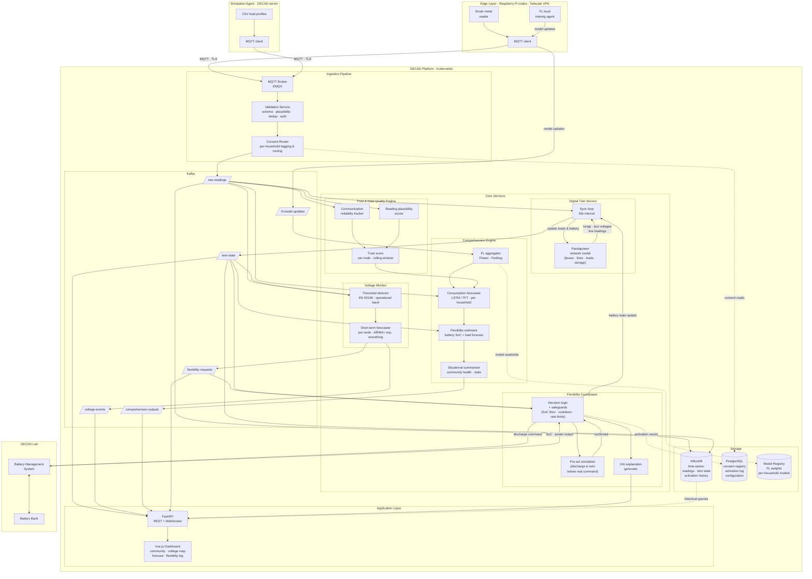

# UC4 — Computational Architecture

```mermaid
flowchart TD

    subgraph EDGE["Edge Layer · Raspberry Pi nodes · Tailscale VPN"]
        direction LR
        METER["Smart meter\nreader"]
        FLEDGE["FL local\ntraining agent"]
        MQTTC["MQTT client"]
        METER --> MQTTC
        FLEDGE -->|model updates| MQTTC
    end

    subgraph SIMAGENT["Simulation Agent · GECAD server"]
        direction LR
        CSV["CSV load profiles"]
        SIMCLI["MQTT client"]
        CSV --> SIMCLI
    end

    subgraph PLATFORM["GECAD Platform · Kubernetes"]

        subgraph INGEST["Ingestion Pipeline"]
            BROKER["MQTT Broker\nEMQX"]
            VALID["Validation Service\nschema · plausibility · dedup · auth"]
            CONSENT["Consent Router\nper-household tagging & routing"]
            BROKER --> VALID --> CONSENT
        end

        subgraph KAFKA["Kafka"]
            direction LR
            KRR[/"raw-readings"/]
            KTS[/"twin-state"/]
            KVE[/"voltage-events"/]
            KFR[/"flexibility-requests"/]
            KCO[/"comprehension-outputs"/]
            KFL[/"fl-model-updates"/]
        end

        subgraph CORE["Core Services"]
            direction TB

            subgraph TWIN["Digital Twin Service"]
                PPNET["Pandapower\nnetwork model\n(buses · lines · loads · storage)"]
                SYNCLOOP["Sync loop\n30s interval"]
                SYNCLOOP -->|update loads & battery| PPNET
                PPNET -->|runpp · bus voltages\nline loadings| SYNCLOOP
            end

            subgraph VOLTMON["Voltage Monitor"]
                THRESH["Threshold detector\nEN 50160 · operational band"]
                FORECAST["Short-term forecaster\nper-node · ARIMA / exp. smoothing"]
                THRESH --> FORECAST
            end

            subgraph FLEXCOORD["Flexibility Coordinator"]
                DECIDE["Decision logic\n+ safeguards\n(SoC floor · cooldown · rate limits)"]
                SIMACT["Pre-act simulation\n(discharge in twin\nbefore real command)"]
                XAIGEN["XAI explanation\ngenerator"]
                DECIDE --> SIMACT
                SIMACT -->|confirmed| DECIDE
                DECIDE --> XAIGEN
            end

            subgraph COMPENG["Comprehension Engine"]
                FLAGG["FL aggregator\nFlower · FedAvg"]
                CONSFORECAST["Consumption forecaster\nLSTM / TFT · per household"]
                FLEXEST["Flexibility estimator\nbattery SoC + load forecast"]
                SITSUM["Situational summariser\ncommunity health · state"]
                FLAGG --> CONSFORECAST
                CONSFORECAST --> FLEXEST
                FLEXEST --> SITSUM
            end

            subgraph TRUSTENG["Trust & Data Quality Engine"]
                COMREL["Communication\nreliability tracker"]
                PLAUS["Reading plausibility\nscorer"]
                TSCORE["Trust score\nper node · rolling window"]
                COMREL --> TSCORE
                PLAUS --> TSCORE
            end
        end

        subgraph STORAGE["Storage"]
            INFLUX[("InfluxDB\ntime-series:\nreadings · twin state\nactivation history")]
            PG[("PostgreSQL\nconsent registry\nactivation log\nconfiguration")]
            MODELREG[("Model Registry\nFL weights\nper-household models")]
        end

        subgraph APPLAYER["Application Layer"]
            APIGW["FastAPI\nREST + WebSocket"]
            DASH["Vue.js Dashboard\ncommunity · voltage map\nforecast · flexibility log"]
            APIGW --> DASH
        end

    end

    subgraph LAB["GECAD Lab"]
        BMS["Battery Management\nSystem"]
        BATTERIES["Battery Bank"]
        BMS <--> BATTERIES
    end

    %% ── Edge & sim → broker ──────────────────────────────────────
    MQTTC  -->|"MQTT · TLS"| BROKER
    SIMCLI -->|"MQTT · TLS"| BROKER

    %% ── Ingestion → Kafka ────────────────────────────────────────
    CONSENT --> KRR
    MQTTC   -->|model updates| KFL

    %% ── Kafka → Digital Twin ─────────────────────────────────────
    KRR --> SYNCLOOP

    %% ── Digital Twin → Kafka ─────────────────────────────────────
    SYNCLOOP --> KTS

    %% ── Kafka → Voltage Monitor ──────────────────────────────────
    KRR --> THRESH
    KTS --> THRESH

    %% ── Voltage Monitor → Kafka ──────────────────────────────────
    FORECAST --> KVE
    FORECAST --> KFR

    %% ── Kafka → Trust Engine ─────────────────────────────────────
    KRR --> COMREL
    KRR --> PLAUS

    %% ── Trust Engine → Kafka (implicit via Comprehension) ────────
    TSCORE --> CONSFORECAST

    %% ── Kafka → Comprehension Engine ─────────────────────────────
    KRR --> CONSFORECAST
    KTS --> FLEXEST
    KFL --> FLAGG

    %% ── Comprehension Engine → Kafka ─────────────────────────────
    SITSUM --> KCO

    %% ── Kafka → Flexibility Coordinator ──────────────────────────
    KFR --> DECIDE
    KTS --> DECIDE

    %% ── Flexibility Coordinator ↔ BMS ────────────────────────────
    DECIDE  -->|discharge command| BMS
    BMS     -->|SoC · power output| DECIDE

    %% ── Flexibility Coordinator → twin feedback ───────────────────
    DECIDE -->|battery state update| SYNCLOOP

    %% ── Storage writes ───────────────────────────────────────────
    KRR --> INFLUX
    KTS --> INFLUX
    DECIDE -.->|activation record| PG
    CONSENT -.->|consent reads| PG
    FLAGG   -.->|model read/write| MODELREG

    %% ── API layer subscriptions ──────────────────────────────────
    KTS --> APIGW
    KVE --> APIGW
    KCO --> APIGW
    KFR --> APIGW
    XAIGEN --> APIGW
    INFLUX -.->|historical queries| APIGW
```
