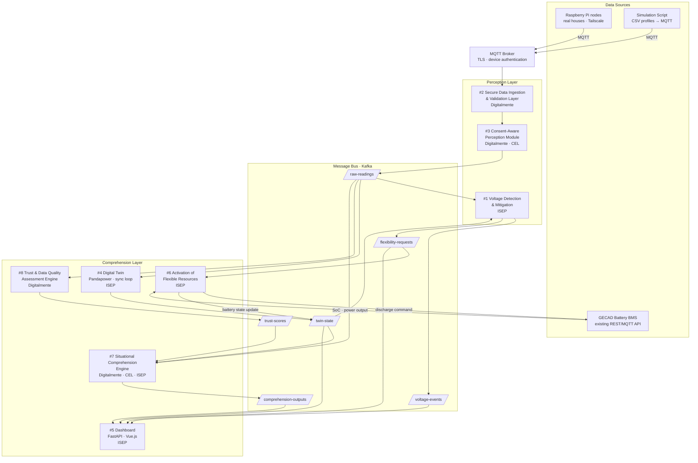

# UC4 — Architecture Diagram (Draft)

## Component summary

| # | Enabler | Layer | Party | Core technology |
|---|---------|-------|-------|----------------|
| 1 | Voltage Detection & Mitigation | Perception | ISEP | Kafka consumer · threshold + forecast |
| 2 | Secure Data Ingestion & Validation | Perception | Digitalmente | Schema validation · dead-letter queue |
| 3 | Consent-Aware Perception Module | Perception | Digitalmente · CEL | Consent registry · message router |
| 4 | Digital Twin | Comprehension | ISEP | Pandapower · sync loop |
| 5 | Dashboard | Comprehension | ISEP | FastAPI · Vue.js |
| 6 | Activation of Flexible Resources | Comprehension | ISEP | BMS API · XAI · safeguards |
| 7 | Situational Comprehension Engine | Comprehension | Digitalmente · CEL · ISEP | Federated learning · consumption forecast |
| 8 | Trust & Data Quality Engine | Comprehension | Digitalmente | Per-node trust scores |

## Key data flows

- **raw-readings** — validated per-household meter readings (voltage, power, timestamp) after consent filtering
- **twin-state** — Pandapower outputs: per-bus voltage, line loadings, battery SoC, published every sync interval
- **voltage-events** — NORMAL / WARNING / CRITICAL per node, emitted by #1
- **flexibility-requests** — structured trigger events (node, deviation magnitude, urgency) from #1 or operator
- **trust-scores** — per-node data quality weights [0–1], consumed by #7
- **comprehension-outputs** — consumption forecasts, aggregate forecast, flexibility estimate, situational summary
