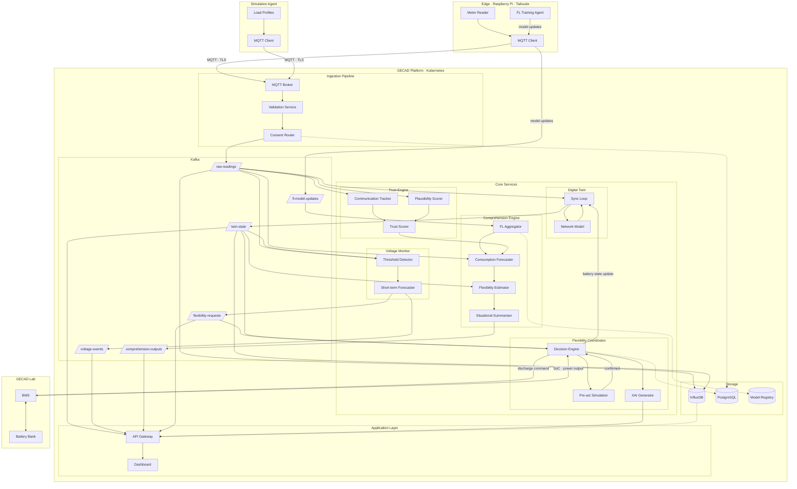

# UC4 — Computational Architecture

```mermaid
flowchart TD

    subgraph EDGE["Edge · Raspberry Pi · Tailscale"]
        direction LR
        METER["Meter Reader"]
        FLEDGE["FL Training Agent"]
        MQTTC["MQTT Client"]
        METER --> MQTTC
        FLEDGE -->|model updates| MQTTC
    end

    subgraph SIMAGENT["Simulation Agent"]
        direction LR
        CSV["Load Profiles"]
        SIMCLI["MQTT Client"]
        CSV --> SIMCLI
    end

    subgraph PLATFORM["GECAD Platform · Kubernetes"]

        subgraph INGEST["Ingestion Pipeline"]
            BROKER["MQTT Broker"]
            VALID["Validation Service"]
            CONSENT["Consent Router"]
            BROKER --> VALID --> CONSENT
        end

        subgraph KAFKA["Kafka"]
            direction LR
            KRR[/"raw-readings"/]
            KTS[/"twin-state"/]
            KVE[/"voltage-events"/]
            KFR[/"flexibility-requests"/]
            KCO[/"comprehension-outputs"/]
            KFL[/"fl-model-updates"/]
        end

        subgraph CORE["Core Services"]
            direction TB

            subgraph TWIN["Digital Twin"]
                PPNET["Network Model"]
                SYNCLOOP["Sync Loop"]
                SYNCLOOP --> PPNET
                PPNET --> SYNCLOOP
            end

            subgraph VOLTMON["Voltage Monitor"]
                THRESH["Threshold Detector"]
                FORECAST["Short-term Forecaster"]
                THRESH --> FORECAST
            end

            subgraph FLEXCOORD["Flexibility Coordinator"]
                DECIDE["Decision Engine"]
                SIMACT["Pre-act Simulation"]
                XAIGEN["XAI Generator"]
                DECIDE --> SIMACT
                SIMACT -->|confirmed| DECIDE
                DECIDE --> XAIGEN
            end

            subgraph COMPENG["Comprehension Engine"]
                FLAGG["FL Aggregator"]
                CONSFORECAST["Consumption Forecaster"]
                FLEXEST["Flexibility Estimator"]
                SITSUM["Situational Summariser"]
                FLAGG --> CONSFORECAST
                CONSFORECAST --> FLEXEST
                FLEXEST --> SITSUM
            end

            subgraph TRUSTENG["Trust Engine"]
                COMREL["Communication Tracker"]
                PLAUS["Plausibility Scorer"]
                TSCORE["Trust Scorer"]
                COMREL --> TSCORE
                PLAUS --> TSCORE
            end
        end

        subgraph STORAGE["Storage"]
            INFLUX[("InfluxDB")]
            PG[("PostgreSQL")]
            MODELREG[("Model Registry")]
        end

        subgraph APPLAYER["Application Layer"]
            APIGW["API Gateway"]
            DASH["Dashboard"]
            APIGW --> DASH
        end

    end

    subgraph LAB["GECAD Lab"]
        BMS["BMS"]
        BATTERIES["Battery Bank"]
        BMS <--> BATTERIES
    end

    %% Edge & sim → broker
    MQTTC  -->|"MQTT · TLS"| BROKER
    SIMCLI -->|"MQTT · TLS"| BROKER

    %% Ingestion → Kafka
    CONSENT --> KRR
    MQTTC   -->|model updates| KFL

    %% Kafka → Digital Twin
    KRR --> SYNCLOOP

    %% Digital Twin → Kafka
    SYNCLOOP --> KTS

    %% Kafka → Voltage Monitor
    KRR --> THRESH
    KTS --> THRESH

    %% Voltage Monitor → Kafka
    FORECAST --> KVE
    FORECAST --> KFR

    %% Kafka → Trust Engine
    KRR --> COMREL
    KRR --> PLAUS

    %% Trust Engine → Comprehension
    TSCORE --> CONSFORECAST

    %% Kafka → Comprehension Engine
    KRR --> CONSFORECAST
    KTS --> FLEXEST
    KFL --> FLAGG

    %% Comprehension Engine → Kafka
    SITSUM --> KCO

    %% Kafka → Flexibility Coordinator
    KFR --> DECIDE
    KTS --> DECIDE

    %% Flexibility Coordinator ↔ BMS
    DECIDE  -->|discharge command| BMS
    BMS     -->|SoC · power output| DECIDE

    %% Flexibility Coordinator → twin feedback
    DECIDE -->|battery state update| SYNCLOOP

    %% Storage
    KRR --> INFLUX
    KTS --> INFLUX
    DECIDE -.-> PG
    CONSENT -.-> PG
    FLAGG   -.-> MODELREG

    %% API layer
    KTS --> APIGW
    KVE --> APIGW
    KCO --> APIGW
    KFR --> APIGW
    XAIGEN --> APIGW
    INFLUX -.-> APIGW
```
