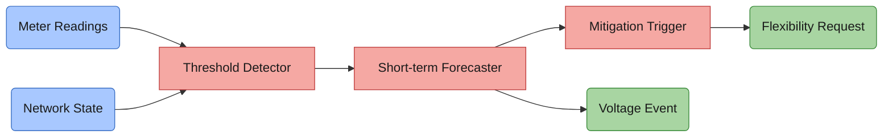
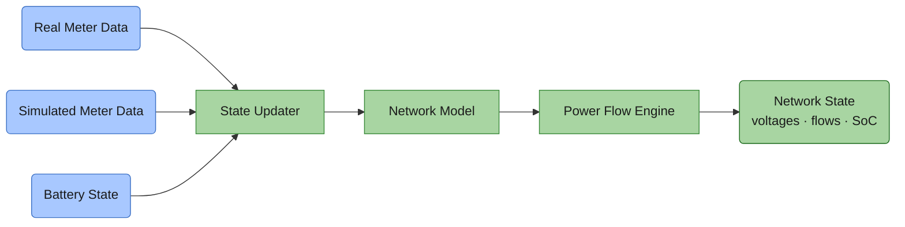
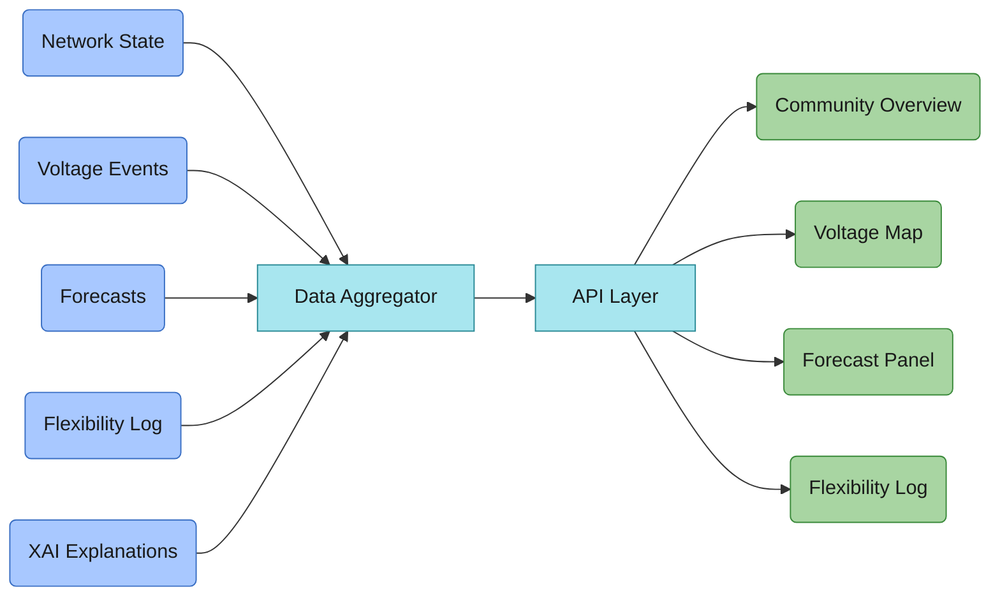
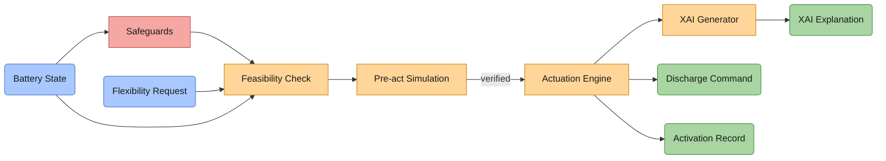
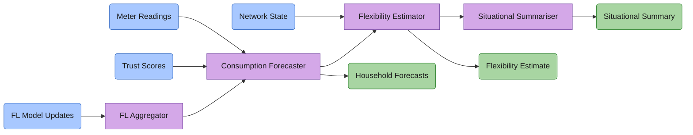
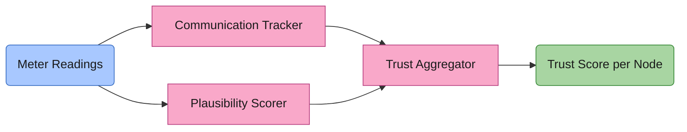

# UC4 — Enabler Concept Architectures

---

## Perception

---

### #1 · Autonomous Detection and Mitigation of Voltage Issues



---

### #2 · Secure Data Ingestion & Validation Layer

```mermaid
flowchart LR

    classDef input   fill:#a8c8ff,stroke:#3a6fc4,color:#1a1a1a
    classDef proc    fill:#a8c8ff,stroke:#1a4a9a,color:#1a1a1a
    classDef output  fill:#a8d5a2,stroke:#3a8a3a,color:#1a1a1a
    classDef reject  fill:#f5a8a3,stroke:#c04040,color:#1a1a1a
    classDef log     fill:#e8e8e8,stroke:#909090,color:#1a1a1a

    DM("Device Message")

    AUTH["Authentication"]
    SV["Schema Validator"]
    PC["Plausibility Checker"]
    AUTH --> SV --> PC

    VS("Validated Data Stream")
    DLQ("Dead Letter Queue")
    AL("Audit Log")

    DM --> AUTH
    PC --> VS
    AUTH -->|rejected| DLQ
    SV  -->|invalid|  DLQ
    PC  -->|implausible| DLQ
    AUTH -.-> AL
    SV   -.-> AL
    PC   -.-> AL

    class DM input
    class AUTH,SV,PC proc
    class VS output
    class DLQ reject
    class AL log
```

---

### #3 · Consent-Aware Energy Data Perception Module

```mermaid
flowchart LR

    classDef input   fill:#a8c8ff,stroke:#3a6fc4,color:#1a1a1a
    classDef proc    fill:#f9a8c9,stroke:#b84080,color:#1a1a1a
    classDef full    fill:#a8d5a2,stroke:#3a8a3a,color:#1a1a1a
    classDef partial fill:#ffd599,stroke:#c68000,color:#1a1a1a
    classDef blocked fill:#e8e8e8,stroke:#909090,color:#1a1a1a

    ID("Incoming Data Stream")
    CR("Consent Registry")

    CL["Consent Lookup"]
    DC["Data Classifier"]
    RE["Routing Engine"]
    CL --> DC --> RE

    FDS("Full Data Stream")
    ADS("Anonymised Stream")
    BL("Blocked")

    ID --> CL
    CR --> CL
    RE -->|full consent|    FDS
    RE -->|partial consent| ADS
    RE -->|no consent|      BL

    class ID,CR input
    class CL,DC,RE proc
    class FDS full
    class ADS partial
    class BL blocked
```

---

## Comprehension

---

### #4 · Digital Twin for Electricity Distribution Network



---

### #5 · Dashboard for Energy Community Management



---

### #6 · Activation of Flexible Resources



---

### #7 · Energy Community Situational Comprehension Engine



---

### #8 · Trust & Data Quality Assessment Engine


