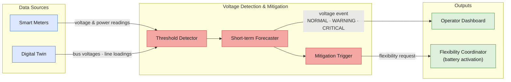
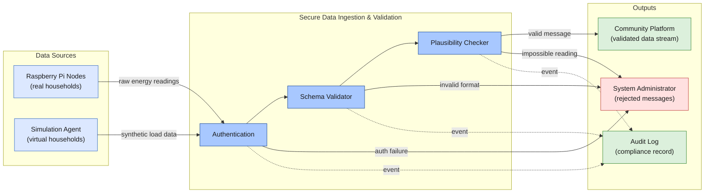
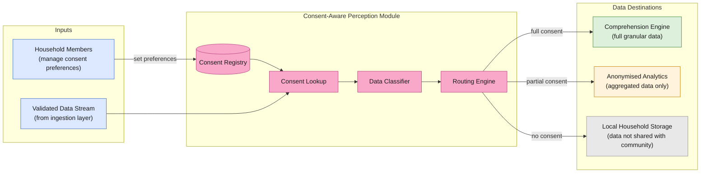
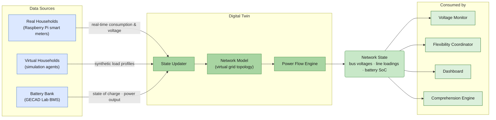
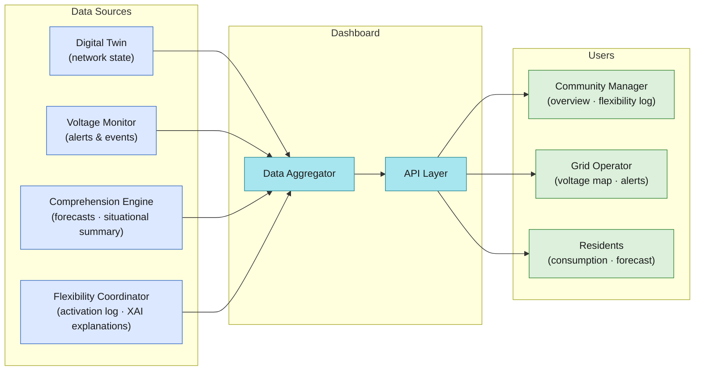
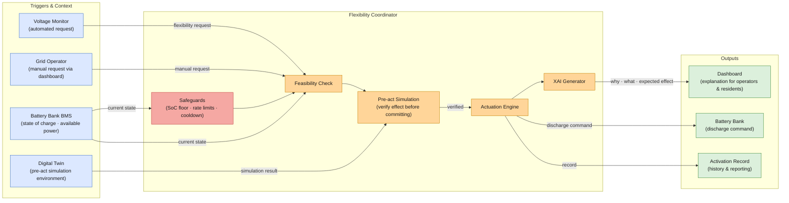
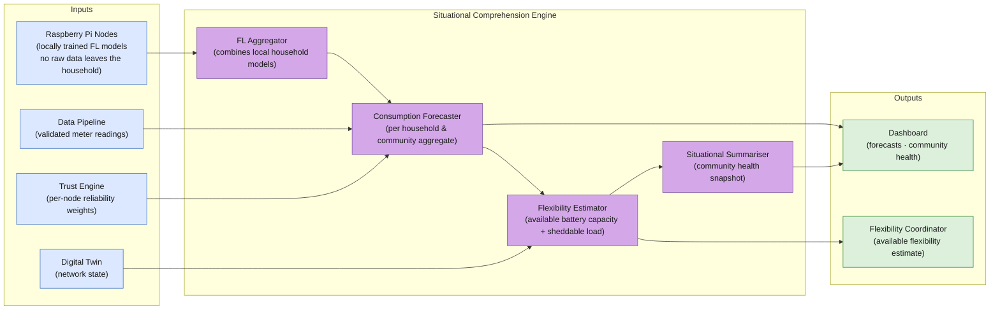
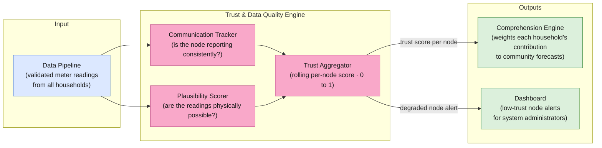

# UC4 — Enabler Concept Architectures

---

## Perception

---

### #1 · Autonomous Detection and Mitigation of Voltage Issues

---

### #2 · Secure Data Ingestion & Validation Layer

---

### #3 · Consent-Aware Energy Data Perception Module

---

## Comprehension

---

### #4 · Digital Twin for Electricity Distribution Network

---

### #5 · Dashboard for Energy Community Management

---

### #6 · Activation of Flexible Resources

---

### #7 · Energy Community Situational Comprehension Engine

---

### #8 · Trust & Data Quality Assessment Engine

